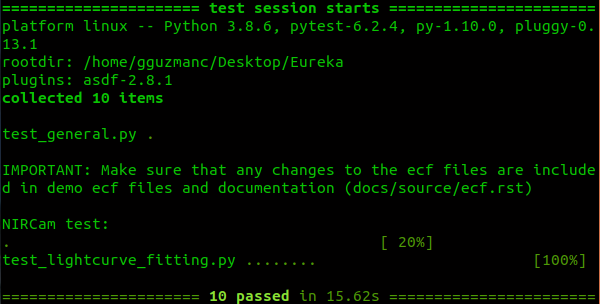
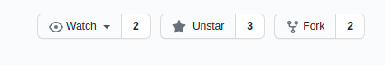

# Contributing to Eureka!

## Page information

Here you will find information on how to contribute to Eureka! Which includes the importance of
[testing](#Testing-Eureka!) as well as some [GitHub basics](#GitHub-Basics)

## Testing Eureka!

As of now, tests for Stage 3, Stage 4, as well as light curve fitting functionality for NIRCam have been written for
Eureka!. **It is required for all contributors of Eureka! to run these tests locally before opening a pull request
with their new code**. By running the tests locally, the contributor will be able to see whether the functionality of
the main code is still intact. This requirement is common in software development teams and is meant to encourage smooth
collaboration by helping track small bugs or changes that affect the basic functionality of the code so that colleagues won't have to.

For these tests, the `pytest` package (<a href="https://docs.pytest.org/en/6.2.x/getting-started.html" target="_blank"> link </a>) will be used. Once installed, the user submitting a pull request may navigate to the tests folder in Eureka! (`eureka/tests`) and run
the following command:
```bash
pytest
```

Which will run the suite of tests found within the folder. To run a specific test, let's use NIRCam tests as an example, then the following command can be used:
```bash
pytest -k test_NIRCam
```

Everything should pass and a result similar to the following picture should be seen.



If this isn't the case, tracking the error will be necessary. Some common errors regarding basic functionality of the code are:

* Renaming functions or packages with no follow-through in code applications of the function (or in test code)
* Added ecf file parameters with no follow-through in code applications of the parameter (or test ecf files)
* Bugs - spelling errors, indentation errors, escape sequence errors

It is therefore the responsibility of the contributor to update the tests and the code until local tests run correctly. Of course,
there will be times where this might be harder than expected, and in those cases we welcome contributors to speak thoroughly on the
issues within their pull request so other team members may help them and be aware of the problem.

## GitHub Basics

This section will go over how to best contribute to the Eureka project utilizing GitHub tools such as forking, and will be dedicated to Eureka-specific examples. If you are a beginner to GitHub, a comprehensive introduction to GitHub can be found on <a href="https://christinahedges.github.io/astronomy_workflow/index.html" target="_blank"> the following page.</a>

Because Eureka is a repository where contributions are by invitation, cloning <a href="https://github.com/kevin218/Eureka" target="_blank">the repository</a> locally and trying to push to it will not work due to lack of permissions. Yet, this does not mean people are excluded from contributing to Eureka! The way to contribute is by creating a GitHub "fork" of the original repository. A fork creates a copy of the repository on your own GitHub account that you can then push to freely without disrupting the original repository's workflow. Once you have finished the feature you are working on in your fork of Eureka you can then open a "pull request" in the original Eureka repository, where the changes you made can be reviewed and perhaps even integrated by the repository owners!

The details of this process are described below.

### **Creating a Fork of Eureka from Scratch**

To create a fork of the Eureka repository all you have to do is go on the repository website and
press the "fork" button that can be seen on the top right.



Once you have forked the repository you should be able to find the link of your own copy of Eureka by accessing the
Eureka repository now found in your own personal GitHub page.


You can then copy the link and run
```bash
git clone [insert link here]
```

Now you have both a copy in your online GitHub repository (what we'll call "remote") and a copy you can work on in your
local machine (what we'll call "local") that can push changes to your online copy of Eureka! To link the remote and local copies do:
```bash
git remote add origin [insert same link here]
```

This sets up tracking to "origin" which is your remote copy of Eureka, so that you can push to it.

### **Branching in Order to Keep a Clean Workflow**

It's not enough to just fork the repository and clone it, because Eureka is a project in which there are many contributions
happening at the same time, you want to keep a clean copy of Eureka as your main branch! This will allow for you to easily download changes that have happened in the original Eureka repository and make sure that none of your work conflicts with them. The way to open a development branch within your own local copy of Eureka is:
```bash
git checkout -b name_of_branch
```

This will not only create the new branch with your name choice, it will also switch you to the branch. If you ever want to
make sure which branch you're on:
```bash
git branch
```

This will show you a list of branches. You should be seeing two branches, your development branch `name_of_branch` should have a star next to it to show that it is the active branch you're on. The other branch is the main branch.

To switch between branches use:
```bash
git checkout branch_name
```

**You should be doing all of your work in the development branch, and leave the main branch intact for updates.** How to update your local repository will be discussed in detail in the sections below.

### **Committing and Pushing to your Fork**

Once you have worked on all your changes, the way to make them available on the remote (online) version of the Eureka repository is to commit your changes and then push to your fork. To check the changes you have made do:
```bash
git status
```

This will give you a list of all your changes, and you should review that the files that have been added or modified are indeed the ones you worked on. Once you have that clear, you can stage all your changes for commit by doing:
```bash
git add --all
```

If you made a change you do not want to push yet or don't want to include yet, you could add the changes you are ready to commit one by one by doing
```bash
git add file_path/file.py
```
(as it shows up on the status list), and avoid adding the ones you don't want to stage yet.

If you want to discard an entire set of changes to a file, you can do:
```bash
git checkout -- file_path/file.py
```

Yet keep in mind this will delete **all** changes made to a file.

Once you have all the changes staged for commit it is time to commit. You can make sure the changes you are committing are
as expected by doing
```bash
git status
```
once more. Anything that is staged for commit should appear under "Changes to be committed".
If you need to unstage a file, you can do:
```bash
git reset HEAD file_path/file
```
This will prevent that file from being included in the commit unless you stage it again by doing
```bash
git add
```

Once you are sure you have all the changes you want to commit you can do:
```bash
git commit -m "Add a commit message here"
```

The commit message should be descriptive enough to track the changes but not too long.

Once the changes are committed you push them to your online repository by doing:
```bash
git push
```

Once you've done this your changes and branch should appear on your online version of the Eureka repository. You can go to your GitHub page and make sure this is correct.

### **Updating your Local Fork with Any Updates from the Original Eureka Repository**

Because Eureka is a collaborative project, there will be other people working on their own features at the same time as you. If any changes are implemented to the original Eureka repository, this can become a conflict on your future pull request. That is why it is imperative to update your local fork with any updates from the original Eureka repository before attempting to open a pull request.

First, we need to set up a connection between your local copy of the Eureka repository and the remote **original** Eureka repository. To see the current remote repositories linked to your local repository you can do:
```bash
git remote -v
```

This should currently show you something like the following

    origin	https://github.com/your_username/Eureka.git (fetch)
    origin	https://github.com/your_username/Eureka.git (push)

What this is showing us is that your local branch is only currently to connected to the remote copy of Eureka. Yet, in order to update your code with updates from the original Eureka repository, you need to establish a connection to it. Utilizing the standard nomenclature "upstream" (for the original repository):

```bash
git remote add upstream https://github.com/kevin218/Eureka.git
```

Now, if you run
```bash
git remote -v
```
again, you should see the new links to the original Eureka repository:

    origin      https://github.com/your_username/Eureka.git (fetch)
    origin      https://github.com/your_username/Eureka.git (push)
    upstream    https://github.com/kevin218/Eureka.git (fetch)
    upstream    https://github.com/kevin218/Eureka.git (push)

You'll also want to setup your main branch to track from the remote repository automatically, since that branch will be
dedicated to importing the updates done to the original Eureka repository. The way to do this is to first make sure you are in the main branch:
```bash
git checkout main
```
OR
```bash
git checkout main_branch_name
```

Then set the upstream as the original Eureka repository
```bash
git branch --set-upstream upstream/main
```

**This has now set up your main local branch to track changes done in the original Eureka remote repository (upstream) as opposed to your own copy of Eureka (origin). It is imperative then that you make sure all changes you make are in your development branch.** An advice is to constantly double check what branch you're working on. If you have made changes in the main branch by mistake, see how to resolve this in the section *Common Mistakes* below.

It is also worth mentioning that the remotes can be called anything, "origin" and "upstream" are just the standard nomenclature. They can be called anything as long as you are able to keep track of which one is which, which is always possible to check by doing:
```bash
git remote -v
```

Once all of this is setup you are ready to check whether any changes made to the original repository conflict with your own changes.

```bash
git checkout main  # (double check you're on your main branch)

git pull
```

This will give you any changes that have been done to Eureka on your main branch. This process should go smoothly as long as you have not made any changes to the main branch and done all your work in the development branch. Once you have pulled, you need to switch back to your development branch and merge the changes from main.

```bash
git checkout development_branch
```

**Make sure you don't have any changes staged for commit (either commit and push them or unstage them).** Then do:

```bash
git merge main
```
OR
```bash
git merge main_branch_name
```

This will merge all the changes done on the main branch into your feature branch. Git will then proceed to tell you if this merge can be done smoothly or not. If it can it will simply pop up a text editor with a commit message along the lines of 'Merged main to feature branch', once you commit that merge, you can push it up to your remote repository by doing:

```bash
git push  # **Don't forget this step!**
```

If there is a merge conflict, git will tell you. Merge conflicts are not typically hard to fix although they might seem scary, usually what it means is that while you were working on your feature someone else did work on the same lines of code, and your version and the original Eureka version are in conflict. Depending on the editor you use these merge conflicts can be easy to track down and resolve. If your editor doesn't point you to the main conflicts automatically, git should tell you the files in which the merge conflicts occurred. You can then open the file and find lines that look like this:

    <<<<<<< HEAD
    current change
    ===========
    change that would be merged
    >>>>>>>>>>>

Pick which one you'd like to keep by deleting the other one. Once you have resolved all conflicts you can finish the merge by doing the standard commit process: stage your changes and commit.

```bash
git add file_path/filename.py
```
OR
```bash
git add --all
```
and then
```bash
git commit -m "Commit message"
git push
```

### **Opening a Pull Request with Eureka**

It is good practice that before opening any pull request you should have finished the following checklist:

- [x] Made changes to the code
- [x] Committed those changes
- [x] Pushed the changes to your remote repository
- [x] Checked for any updates to the original Eureka
- [ ] Open Pull Request

Once you have taken care of these things, the next step is done through the GitHub web interface.
Go to your remote copy of Eureka and you will see a button that says "Compare and Open Pull Request".
Press this button to open the pull request, you should then see a new page that shows all the changes
done that are included in the pull request as well as a text box to include details and information about
the changes done to the code in your pull request. It is always good to be as detailed as possible with anything
that might help the reviewers understand your code better. Once you've reviewed the changes and described your feature
you can open the pull request. Congratulations!

**Important Note:** Even after opening a pull request you can continue to work on your code, every change you push into the code will show up on the pull request. This is meant to be a feature since people can review and comment on your code and you can make the changes directly. Yet, if you are going to work on another feature separate from the one you opened a pull request for, then it is good to create a new development branch for that other feature and work it from there. This of course, as long as your new feature is standalone and does not depend on code submitted in your first pull request. If you started working on changes in your first development branch but you actually want them on a new branch, refer to the troubleshooting section below.

### **Troubleshooting**

#### Didn't fork and started working on a local version of the original Eureka

This is not an issue at all! Just make sure you have your origin and upstream setup correctly by doing

```bash
git remote -v
```

If origin is pointing to the original Eureka repository (`https://github.com/kevin218/Eureka.git`) and you want to keep the standard nomenclature discussed above then you can rename origin to upstream the following way:

```bash
git remote rename origin upstream
```

Once that's done you can add your own fork as origin by forking the repository on GitHub as shown at the beginning of the tutorial, getting the link, and then doing:

```bash
git remote add origin https://github.com/your_username/Eureka.git # (fork link)
```

Now if you do
```bash
git remote -v
```

You should see something like

    origin      https://github.com/your_username/Eureka.git (fetch)
    origin      https://github.com/your_username/Eureka.git (push)
    upstream    https://github.com/kevin218/Eureka.git (fetch)
    upstream    https://github.com/kevin218/Eureka.git (push)

You're good to go!

#### Made Changes in Main Branch instead of Development Branch

Let's say you worked on changes in your main branch instead of your development branch. If they are not yet committed you can do

```bash
git add --all # (stage your changes)
git stash
```

Switch to your development branch by doing

```bash
git checkout branch_name
```

and then do

```bash
git stash pop
```

If the changes have been committed then it is a little more complicated, but not too much to worry about. You should create a new branch while being on the main branch that has the committed changes

```bash
git checkout -b new_development_branch
```

This will create a new branch with the committed changes included, and it should then become your new development branch. Then checkout to the main branch

```bash
git checkout main_branch_name
```

and reset the committed changes by doing

```bash
git reset --hard HEAD^1
```

If you have committed to the main branch more than once, then the number should be however many commits back is the original main branch's last commit, for example:

    ---- 1 ---- 2 ---- 3 ---- 4 ---- 5 ---- 6
                ^                           ^
              original                   master
            master commit

Would be:

```bash
git reset --hard HEAD^4
```
