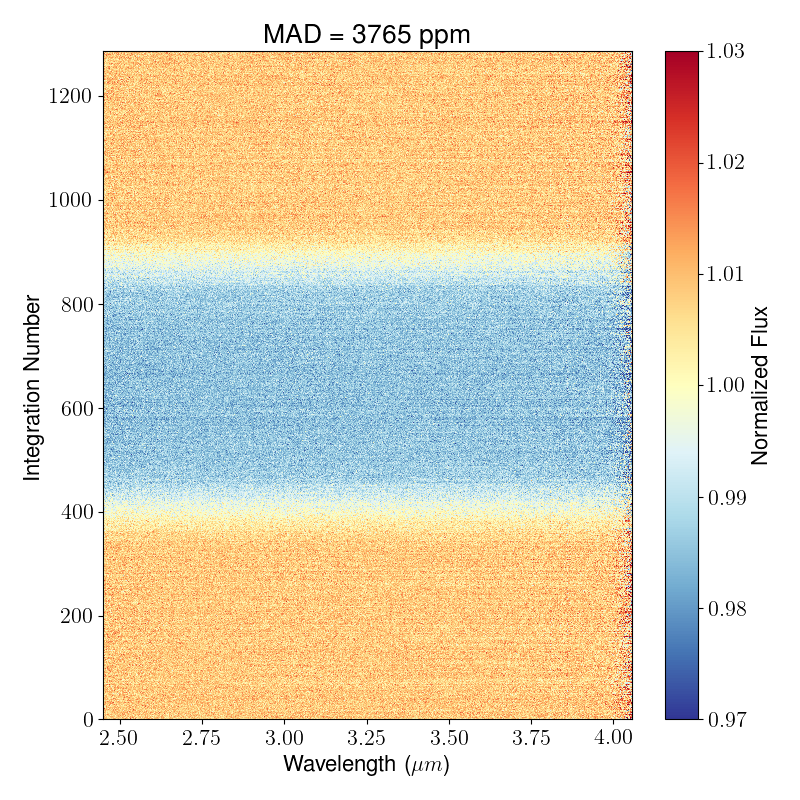
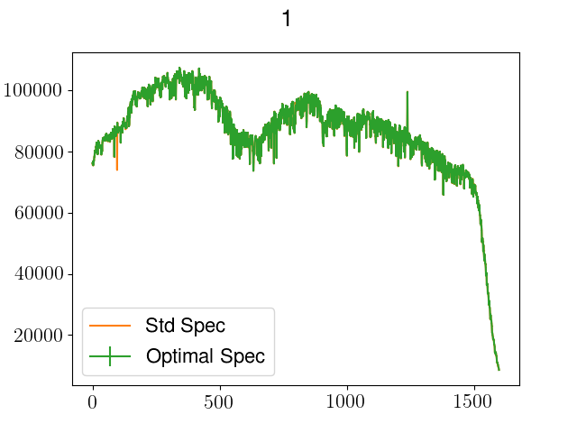
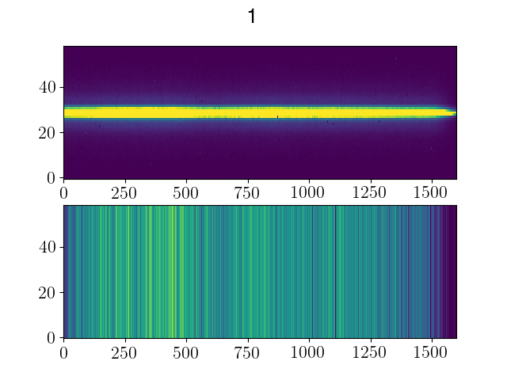
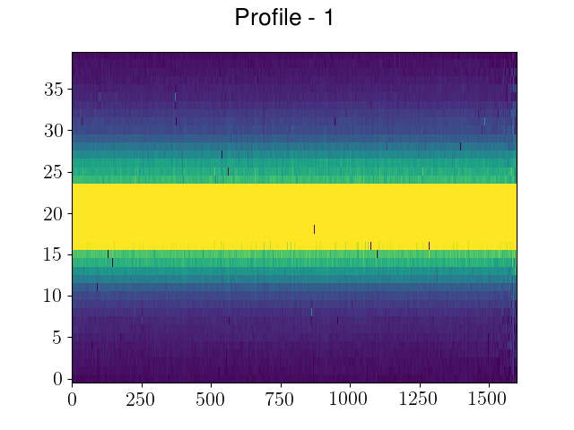
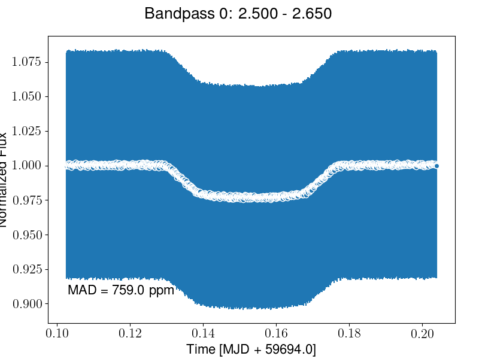

.. _ecf:

Eureka! Control File (.ecf)
============================

To run the different Stages of ``Eureka!``, the pipeline requires control files (.ecf) where Stage-specific parameters are defined (e.g. aperture size, path of the data, etc.).

In the following, we look at the contents of the ecf for Stages 2, 3, and 4.

Stage 2
--------

.. include:: ../media/S2_template.ecf
   :literal:

suffix
'''''''
Data file suffix (e.g. rateints).

.. note::
	Note that other Instruments might used different suffixes!

slit_y_low & slit_y_high
'''''''''''''''''''''''''
Controls the cross-dispersion extraction. Use None to rely on the default parameters.

waverange_start & waverange_end
''''''''''''''''''''''''''''''''
Modify the existing file to change the dispersion extraction (DOES NOT WORK). Use None to rely on the default parameters.

skip_*
'''''''
If True, skip the named step.

.. note::
	Note that some instruments and observing modes might skip a step either way! See `here <https://jwst-pipeline.readthedocs.io/en/latest/jwst/pipeline/calwebb_spec2.html>`_ for the list of steps run for each instrument/mode by the STScI's JWST pipeline.

testing_S2
'''''''''''
If True, outputs won't be saved and plots won't be made. Useful for making sure most of the code can run.

hide_plots
'''''''''''
If True, plots will automatically be closed rather than popping up on the screen.

topdir + inputdir
'''''''''''''''''
The path to the directory containing the Stage 1 JWST data.

topdir + outputdir
'''''''''''''''''''
The path to the directory in which to output the Stage 2 JWST data and plots.

Stage 3
--------

.. include:: ../media/S3_template.ecf
   :literal:

ncpu
'''''
Sets the number of cores being used when ``Eureka!`` is executed.
Currently, the only parallelized part of the code is the **background subtraction** for every individual integration and is being initialized in s3_reduce.py with:

:func:`util.BGsubtraction<eureka.lib.util.BGsubtraction>`

suffix
'''''''
If your data directory (``topdir + inputdir``, see below) contains files with different data formats, you want to consider setting this variable.

E.g.: Simulated NIRCam Data:

Stage 2 - For NIRCam, Stage 2 consists of the flat field correction, WCS/wavelength solution, and photometric calibration (counts/sec -> MJy). Note that this is specifically for NIRCam: the steps in Stage 2 change a bit depending on the instrument. The Stage 2 outputs are roughly equivalent to a "flt" file from HST.

- ``Stage 2 Outputs/*calints.fits`` - Fully calibrated images (MJy) for each individual integration. This is the one you want if you're starting with Stage 2 and want to do your own spectral extraction.

- ``Stage 2 Outputs/*x1dints.fits`` - A FITS binary table containing 1D extracted spectra for each integration in the "calint" files.

As we want to do our own spectral extraction, we set this variable to ``calints``.

.. note::
	Note that other Instruments might used different suffixes!

ywindow & xwindow
''''''''''''''''''
Can be set if one wants to remove edge effects (e.g.: many nans at the edges).

Below an example with the following setting:

.. code-block:: python

    ywindow     [5,64]
    xwindow     [100,1700]

.. image:: ../media/xywindow.png

Everything outside of the box will be discarded and not used in the analysis.

src_pos_type
'''''''''''''
Determine the source position on the detector when not given in header (Options: gaussian, weighted, or max).

bg_hw & spec_hw
''''''''''''''''
``bg_hw`` and  ``spec_hw`` set the background and spectrum aperture relative to the source position.

Let's looks at an **example** with the following settings:

.. code-block:: python

    bg_hw    = 23
    spec_hw  = 18

Looking at the fits file science header, we can determine the source position:

.. code-block:: python

    src_xpos = hdulist['SCI',1].header['SRCXPOS']-xwindow[0]
    src_ypos = hdulist['SCI',1].header['SRCYPOS']-ywindow[0]

Let's assume in our example that ``src_ypos = 29``.

(xwindow[0] and ywindow[0] corrects for the trimming of the data frame, as the edges were removed with the xwindow and ywindow parameters)

The plot below shows you which parts will be used for the background calculation (shaded in white; between the lower edge and src_ypos - bg_hw, and src_ypos + bg_hw and the upper edge) and which for the spectrum flux calculation (shaded in red; between src_ypos - spec_hw and src_ypos + spec_hw).

.. image:: ../media/bg_hw.png

bg_thresh
''''''''''
Double-iteration X-sigma threshold for outlier rejection along time axis.
The flux of every background pixel will be considered over time for the current data segment.
e.g: ``bg_thresh = [5,5]``: Two iterations of 5-sigma clipping will be performed in time for every background pixel. Outliers will be masked and not considered in the background flux calculation.

bg_deg
'''''''
Sets the degree of the column-by-column background subtraction. If bg_deg is negative, use the median background of entire frame. Set to None for no background subtraction.
Also, best to emphasize that we're performing column-by-column BG subtraction

The function is defined in :func:`S3_data_reduction.optspex.fitbg<eureka.S3_data_reduction.optspex.fitbg>`

Possible values:

- ``bg_deg = None``: No backgound subtraction will be performed.
- ``bg_deg < 0``: The median flux value in the background area will be calculated and subtracted from the entire 2D Frame for this paticular integration.
- ``bg_deg => 0``: A polynomial of degree `bg_deg` will be fitted to every background column (background at a specific wavelength). If the background data has an outlier (or several) which is (are) greater than 5  * (Mean Absolute Deviation), this value will be not considered as part of the background. Step-by-step:

1. Take background pixels of first column
2. Fit a polynomial of degree  ``bg_deg`` to the background pixels.
3. Calculate the residuals (flux(bg_pixels) - polynomial_bg_deg(bg_pixels))
4. Calculate the MAD (Mean Absolute Deviation) of the greatest background outlier.
5. If MAD of the greatest background outlier is greater than 5, remove this background pixel from the background value calculation. Repeat from Step 2. and repeat as long as there is no 5*MAD outlier in the background column.
6. Calculate the flux of the polynomial of degree  ``bg_deg`` (calculated in Step 2) at the spectrum and subtract it.

p3thresh
'''''''''
Only important if ``bg_deg => 0`` (see above). # sigma threshold for outlier rejection during background subtraction which corresponds to step 3 of optimal spectral extraction, as defined by Horne (1986).

p5thresh
'''''''''
Used during Optimal Extraction. # sigma threshold for outlier rejection during step 5 of optimal spectral extraction, as defined by Horne (1986). Default is 10. For more information, see the source code of :func:`optspex.optimize<eureka.S3_data_reduction.optspex.optimize>`.

p7thresh
'''''''''
Used during Optimal Extraction. # sigma threshold for outlier rejection during step 7 of optimal spectral extraction, as defined by Horne (1986). Default is 10. For more information, see the source code of :func:`optspex.optimize<eureka.S3_data_reduction.optspex.optimize>`.

fittype
''''''''
Used during Optimal Extraction. fittype defines how to construct the normalized spatial profile for optimal spectral extraction. Options are: 'smooth', 'meddata', 'wavelet', 'wavelet2D', 'gauss', or 'poly'. Using the median frame (meddata) should work well with JWST. Otherwise, using a smoothing function (smooth) is the most robust and versatile option. Default is meddata. For more information, see the source code of :func:`optspex.optimize<eureka.S3_data_reduction.optspex.optimize>`.

window_len
'''''''''''
Used during Optimal Extraction. window_len is only used when fittype = 'smooth'. It sets the length scale over which the data are smoothed. Default is 31. For more information, see the source code of :func:`optspex.optimize<eureka.S3_data_reduction.optspex.optimize>`.

prof_deg
'''''''''
Used during Optimal Extraction. prof_deg is only used when fittype = 'poly'. It sets the polynomial degree when constructing the spatial profile. Default is 3. For more information, see the source code of :func:`optspex.optimize<eureka.S3_data_reduction.optspex.optimize>`.

isplots_S3
'''''''''''
Sets how many plots should be saved when running Stage 3.

1. ``isplots_S3 >= 1``:

   1.1  2D light curve without drift correction

2. ``isplots_S3 >= 3``:

   2.1  make optimal spectrum plot

   2.2  make image+background plots

   2.3  plot profile

1.1: Normalized Flux over Time (Integration Number) as a function of Wavelength.

2.1: 1D Spectrum for an Integration using standard spectrum extraction (sum of the aperture; in orange) and optimal spectral extraction (in green).

2.2: *Upper Panel*: 2D Spectrum for an Integration; *Lower Panel*: Column-wise background for an Integration (here ``bg_deg = 0`` was set).

2.3: 2D spectrum for an Integration after Unit conversion

testing_S3
'''''''''''
If set to ``True`` only the last segment (which is usually the smallest) in the ``inputdir`` will be run. Also, only five integrations from the last segment will be reduced.

save_output
'''''''''''
If set to ``True`` output will be saved as files for use in S4. Setting this to ``False`` is useful for quick testing

hide_plots
'''''''''''
If True, plots will automatically be closed rather than popping up on the screen.

topdir + inputdir
''''''''''''''''''
The path to the directory containing the Stage 2 JWST data.

topdir + outputdir
'''''''''''''''''''
The path to the directory in which to output the Stage 3 JWST data and plots.

topdir + ancildir
''''''''''''''''''
The path to the directory containing the ancillary data.

E.g.: NIRCam needs a photometic file and a gainfile file to convert MJy/sr to DN (Data Numbers) and from DN to Electrons, respectively.
The names of the the files needed are given in the header as ``hdulist[0].header['R_PHOTOM']`` and ``hdulist[0].header['R_GAIN']`` and can be downloaded here: `<https://jwst-crds.stsci.edu/browse_db/>`_

Stage 4
--------

.. include:: ../media/S4_template.ecf
   :literal:

nspecchan
''''''''''
Number of spectroscopic channels spread evenly over given wavelength range

wave_min & wave_max
''''''''''''''''''''
Start and End of the wavelength range being considered

allapers
'''''''''
If True, run S4 on all of the apertures considered in S3. Otherwise the code will use the only or newest S3 outputs found in the inputdir. To specify a particular S3 save file, ensure that "inputdir" points to the procedurally generated folder containing that save file (e.g. set inputdir to /Data/JWST-Sim/NIRCam/Stage3/S3_2021-11-08_nircam_wfss_ap10_bg10_run1/).

correctDrift
'''''''''''''
If True, correct for drift/jitter in 1D spectra.

drift_preclip
''''''''''''''
Ignore first drift_preclip points of spectrum when correcting for drift/jitter in 1D spectra.

drift_postclip
'''''''''''''''
Ignore the last drift_postclip points of spectrum when correcting for drift/jitter in 1D spectra. None = no clipping.

drift_range
''''''''''''
Trim spectra by +/- drift_range pixels to compute valid region of cross correlation when correcting for drift/jitter in 1D spectra.

drift_hw
'''''''''
Half-width in pixels used when fitting Gaussian when correcting for drift/jitter in 1D spectra. Must be smaller than drift_range.

drift_iref
'''''''''''
Index of reference spectrum used for cross correlation when correcting for drift/jitter in 1D spectra. -1 = last spectrum.

sub_mean
'''''''''
If True, subtract spectrum mean during cross correlation (can help with cross-correlation step).

isplots_S4
'''''''''''
Sets how many plots should be saved when running Stage 4.

- ``isplots_S4 >= 3``:
   -  Plot each spectroscopic light curve. Below an example for a light curve using the Simulated NIRCam data for WASP-43b between 2.5 and 2.65 micron. Due to a bug in the Simulation pipeline the errorbars are currently way bigger than expected.

hide_plots
'''''''''''
If True, plots will automatically be closed rather than popping up on the screen.

topdir + inputdir
''''''''''''''''''
The path to the directory containing the Stage 3 JWST data.

topdir + outputdir
'''''''''''''''''''
The path to the directory in which to output the Stage 4 JWST data and plots.
