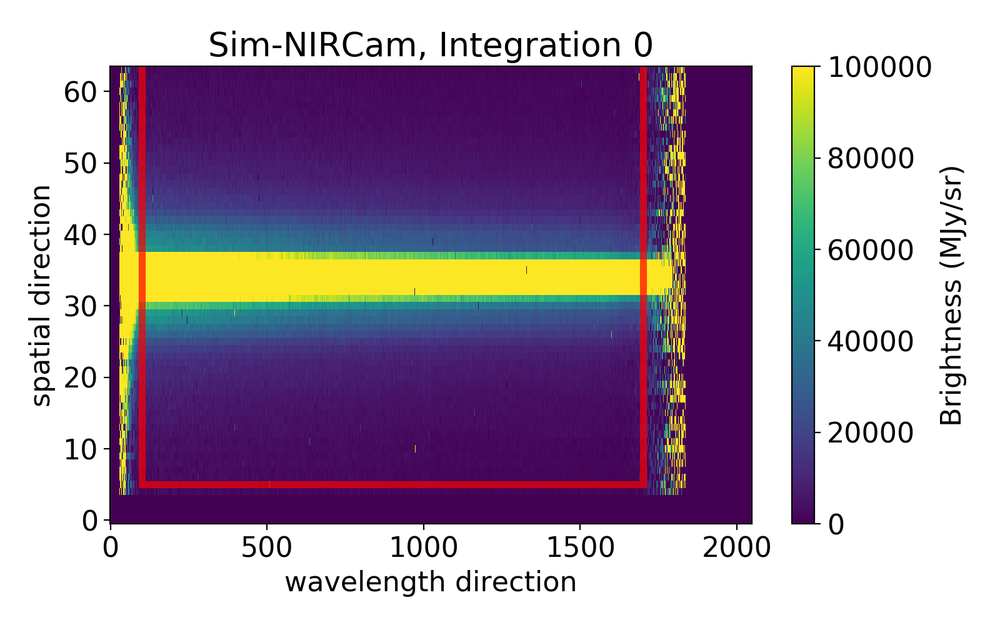
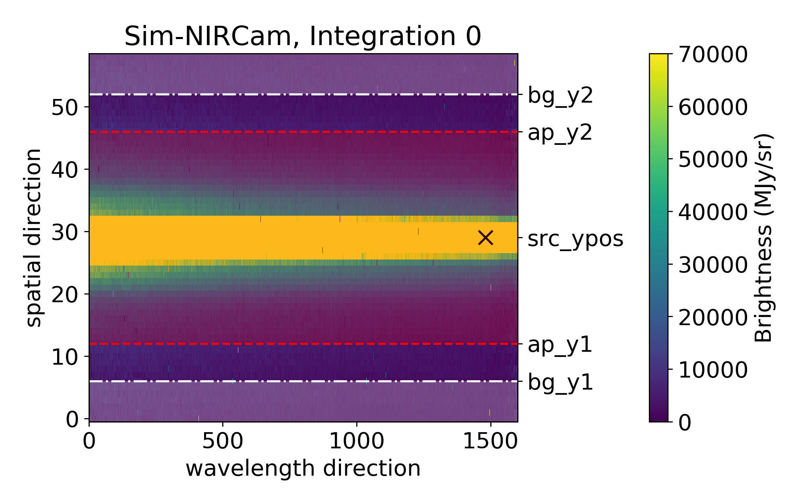
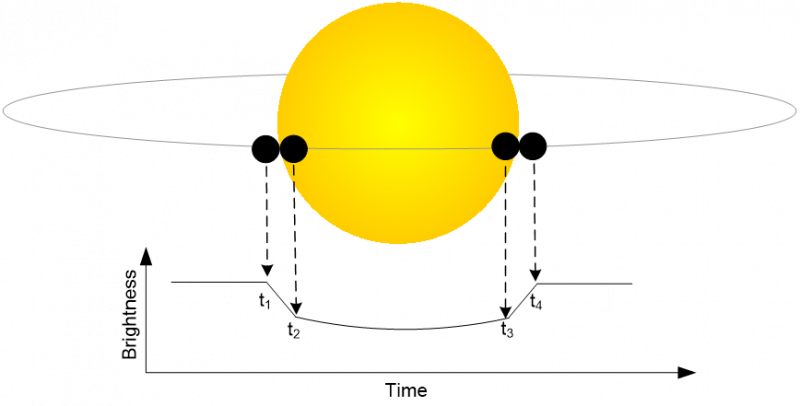
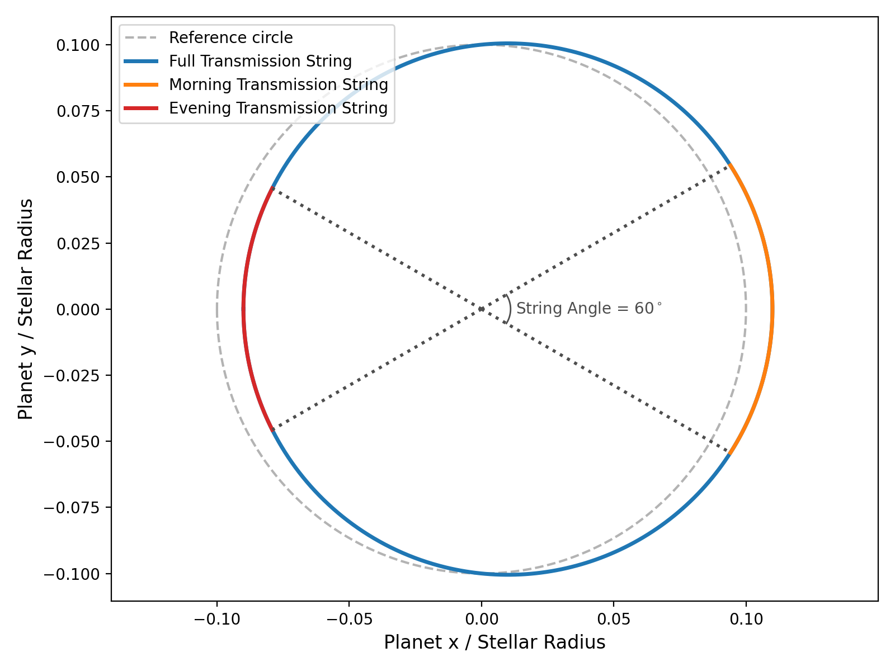

.. _ecf:

Eureka! Control Files (.ecf)
============================

To run the different Stages of ``Eureka!``, the pipeline requires control files (.ecf) where Stage-specific parameters are defined (e.g. aperture size, path of the data, etc.).

In the following, we look at the contents of the ecf for Stages 1, 2, 3, 4, 5, and 6.

Stage 1
-------

.. include:: ../media/S1_template.ecf
   :literal:

suffix
''''''
Data file suffix (e.g. uncal).

pmap
''''
Optional. If you want to use a specific CRDS context pmap (e.g. to reproduce someone else's work), you can specify the pmap number here. For example, to use ``jwst_1089.pmap``, set this ``pmap`` parameter to ``1089``.

ramp_fit_algorithm
''''''''''''''''''
Algorithm to use to fit a ramp to the frame-level images of uncalibrated files.
The current options offerered by the JWST pipeline are ``'OLS_C'`` (Ordinary Least-Squares, which can also be specified as ``'default'``),
``'OLS'`` (which is the same as ``'OLS_C'`` but only uses python),
and ``'LIKELY'`` (which uses a maximum likelihood estimator). The default is ``'OLS_C'``.

ramp_fit_firstgroup
'''''''''''''''''''
A zero-indexed integer that specifies the first group to use for all pixels when fitting the slopes of the ramps. If set to ``None`` or ``0``, the first group will be used (unless marked as DO_NOT_USE by another step). By default is set to ``None``.

ramp_fit_lastgroup
''''''''''''''''''
A zero-indexed integer that specifies the last group to use for all pixels when fitting the slopes of the ramps. If set to ``None`` or the number of groups minus 1, the last group will be used (unless marked as DO_NOT_USE by another step). By default is set to ``None``.

ramp_fit_suppress_one_group
'''''''''''''''''''''''''''
A boolean that specifies whether the slope should be set to zero or estimated for pixels with either a single group or the single frame zero value. By default is set to ``True`` which sets the slopes of such pixels to zero.

maximum_cores
'''''''''''''
Fraction of processor cores to use when computing the jump step and the ramp fits. Options are ``''none'``, ``'quarter'``, ``'half'``, or ``'all'``.

jump_rejection_threshold
''''''''''''''''''''''''
A floating-point value that sets the sigma threshold for jump detection. The default is 4.0, but it is often best to increase this number for time-series observations to avoid excessively high false-positives. The optimal value will vary between different datasets and different instruments, but from experience we have found that values around 6.0--8.0 are often reasonable.

minimum_sigclip_groups
''''''''''''''''''''''
The minimum number of groups to switch the jump detection to use sigma clipping. The default is 100.

skip_*
''''''
If True, skip the named step.

.. note::
   Note that some instruments and observing modes might skip a step either way! See the `calwebb_detector1 docs <https://jwst-pipeline.readthedocs.io/en/latest/jwst/pipeline/calwebb_detector1.html>`__ for the list of steps run for each instrument/mode by the STScI's JWST pipeline.

emicorr_algorithm
'''''''''''''''''
A string that specifies the ``jwst`` EMI-correction algorithm to use if ``skip_emicorr`` is set to ``False``. The options are ``'joint'`` (default), which should work well for all observations (even with few groups per integration),
and ``'sequential'``, which is the legacy algorithm and works poorly on observations with few groups per integration.

custom_linearity
''''''''''''''''
Boolean. If True, allows user to supply a custom linearity correction file and overwrite the default file.

linearity_file
''''''''''''''
The fully qualified path to the custom linearity correction file to use if custom_linearity is True. The linearity file should be a FITS file that is formatted like the ``linearity`` `reference file <https://jwst-pipeline.readthedocs.io/en/latest/jwst/linearity/reference_files.html#linearity-reference-file>`__ from `CRDS <https://jwst-crds.stsci.edu/>`__, with any desired changes made to the values of the file.

custom_mask
'''''''''''
Boolean. If True, allows user to supply a custom bad pixel mask file and overwrite the default file.

mask_file
'''''''''
The fully qualified path to the custom bad pixel mask file to use if custom_mask is True. The mask file should be a FITS file that is formatted like the ``mask`` `reference file <https://jwst-pipeline.readthedocs.io/en/latest/jwst/dq_init/reference_files.html#mask-reference-file>`__ from `CRDS <https://jwst-crds.stsci.edu/>`__ with any additional bad pixels marked by changing the pixel value to the "DO_NOT_USE" value (see `the data quality flags documentation <https://jwst-pipeline.readthedocs.io/en/latest/jwst/references_general/references_general.html#data-quality-flags>`__ for more details on data quality flags)

bias_correction
'''''''''''''''
Method applied to correct the superbias using a scale factor (SF) when no bias pixels are available (i.e., with NIRSpec).  Here, SF = (median of group)/(median of superbias), using a background region that is ``expand_mask`` pixels from the measured trace.  The default option ``None`` applies no correction; ``group_level`` computes SF for every integration in ``bias_group``; ``smooth`` applies a smoothing filter of length ``bias_smooth_length`` to the ``group_level`` SF values; and ``mean`` uses the mean SF over all integrations.  For NIRSpec, we currently recommend using ``smooth`` with a ``bias_smooth_length`` that is ~15 minutes.

Note that this routine requires masking the trace; therefore, ``masktrace`` must be set to True.

bias_group
''''''''''
Integer or string.  Specifies which group number should be used when applying the bias correction.  For NIRSpec, we currently recommend using the first group (``bias_group`` = 1).  There is no group 0.  Users can also specify ``each``, which computes a unique bias correction for each group.

bias_smooth_length
''''''''''''''''''
Integer. When ``bias_correction = smooth``, this value is used as the window length during smoothing across integrations.

custom_bias
'''''''''''
Boolean, allows user to supply a custom superbias file and overwrite the default file.

superbias_file
''''''''''''''
The fully qualified path to the custom superbias file to use if custom_bias is True.

update_sat_flags
''''''''''''''''
Boolean, allows user to have more control over saturation flags. Must be True to use the settings expand_prev_group, dq_sat_mode, and dq_sat_percentile or dq_sat_columns.

expand_prev_group
'''''''''''''''''
Boolean, if a given group is saturated, this option will mark the previous group as saturated as well.

dq_sat_mode
'''''''''''
Method to use for updating the saturation flags. Options are percentile (a pixel must be saturated in this percent of integrations to be marked as saturated), min, and defined (user can define which columns are saturated in a given group)

dq_sat_percentile
'''''''''''''''''
If dq_sat_mode = percentile, percentile threshold to use

dq_sat_columns
''''''''''''''
If dq_sat_mode = defined, list of columns. Should have length Ngroups, each element containing a list of the start and end column to mark as saturated

remove_390hz
''''''''''''
Boolean, an experimental step which removes the 390 Hz periodic noise in MIRI/LRS SLITLESSPRISM group-level data. This step can be quite time consuming, and early testing suggests that it has little impact on the final spectra when also doing row-by-row background subtraction per group in Stage 1 or per integration in Stage 3.

grouplevel_bg
'''''''''''''
Boolean, runs background subtraction at the group level (GLBS) prior to ramp fitting.

ncpu
''''
Number of cpus to use for GLBS

bg_y1
'''''
The pixel number for the end of the bottom background region. The background region goes from the bottom of the subarray to this pixel.

bg_y2
'''''
The pixel number for the start of the top background region. The background region goes from this pixel to the top of the subarray.

bg_deg
''''''
See Stage 3 inputs

bg_method
'''''''''
See Stage 3 inputs

p3thresh
''''''''
See Stage 3 inputs

verbose
'''''''
See Stage 3 inputs

isplots_S1
''''''''''
Sets how many plots should be saved when running Stage 1. A full description of these outputs is available here: :ref:`Stage 3 Output <s3-out>`

nplots
''''''
See Stage 3 inputs

hide_plots
''''''''''
See Stage 3 inputs

bg_row_by_row
'''''''''''''
Set True to perform row-by-row background subtraction (only useful for NIRCam).

bg_x1
'''''
The pixel number for the end of the left background region for row-by-row background subtraction. The background region goes from the left of the subarray to this pixel.

bg_x2
'''''
The pixel number for the start of the right background region for row-by-row background subtraction. The background region goes from this pixel to the right of the subarray.

masktrace
'''''''''
Boolean, creates a mask centered on the trace prior to GLBS for curved traces. ``bg_y1`` and ``bg_y2`` will be ignored if ``masktrace`` is ``True`` since the trace will already be masked.

window_len
''''''''''
Smoothing length for the trace location

expand_mask
'''''''''''
Aperture (in pixels) around the trace to mask

ignore_low
''''''''''
Columns below this index will not be used to create the mask

ignore_hi
'''''''''
Columns above this index will not be used to create the mask

refpix_corr
'''''''''''
Boolean, runs a custom ROEBA (Row-by-row, Odd-Even By Amplifier) routine for PRISM observations which do not have reference pixels within the subarray.

npix_top
''''''''
Number of rows to use for ROEBA routine along the top of the subarray

npix_bot
''''''''
Number of rows to use for ROEBA routine along the bottom of the subarray

topdir + inputdir
'''''''''''''''''
The path to the directory containing the Stage 0 JWST data (uncal.fits). Directories containing spaces should be enclosed in quotation marks.

topdir + outputdir
''''''''''''''''''
The path to the directory in which to output the Stage 1 JWST data and plots. Directories containing spaces should be enclosed in quotation marks.

testing_S1
''''''''''
If True, only a single file will be used, outputs won't be saved, and plots won't be made. Useful for making sure most of the code can run.

default_ramp_fit_weighting
''''''''''''''''''''''''''
Define the method by which individual frame pixels will be weighted during the ramp fitting process. The is specifically for the case where ``ramp_fit_algorithm`` is ``'OLS_C'`` / ``default`` or ``'OLS'``. Options are ``default``, ``unweighted``, ``fixed``, ``interpolated``, ``uniform``, or ``custom``.

``default``: Algorithm provided by the ``jwst`` pipeline. Slope estimation using a least-squares algorithm with an "optimal" weighting, see the `ramp_fitting docs <https://jwst-pipeline.readthedocs.io/en/latest/jwst/ramp_fitting/description.html#optimal-weighting-algorithm>`__.

In short this weights each pixel, :math:`i`, within a slope following :math:`w_i = (i - i_{midpoint})^P`, where the exponent :math:`P` is selected depending on the estimated signal-to-noise ratio of each pixel (see link above).

``unweighted``: Algorithm provided by the ``jwst`` pipeline. Slope estimation using a least-squares algorithm with no weighting.

``fixed``: As with default, except the weighting exponent :math:`P` is fixed to a precise value through the ``default_ramp_fit_fixed_exponent`` entry

``interpolated``: As with default, except the SNR to :math:`P` lookup table is converted to a smooth interpolation.

``flat``: As with default, except the weighting equation is no longer used, and all pixels are weighted equally.

``custom``: As with default, except a custom SNR to :math:`P` lookup table can be defined through the ``default_ramp_fit_custom_snr_bounds`` and ``default_ramp_fit_custom_exponents`` (see example .ecf file).

Stage 2
-------

 A full description of the Stage 2 Outputs is available here: :ref:`Stage 2 Output <s2-out>`

.. include:: ../media/S2_template.ecf
   :literal:

suffix
''''''
Data file suffix (e.g. rateints).

.. note::
	Note that other Instruments might used different suffixes!

pmap
''''
Optional. If you want to use a specific CRDS context pmap (e.g. to reproduce someone else's work), you can specify the pmap number here. For example, to use ``jwst_1089.pmap``, set this ``pmap`` parameter to ``1089``.

slit_y_low & slit_y_high
''''''''''''''''''''''''
Controls the cross-dispersion extraction for NIRSpec. Use None to rely on the default parameters.

tsgrism_extract_height
''''''''''''''''''''''
Controls the cross-dispersion extraction height for NIRCam (default is 64 pixels).

waverange_start & waverange_end
'''''''''''''''''''''''''''''''
Modify the existing file to change the dispersion extraction (DO NOT CHANGE).

skip_*
''''''
If True, skip the named step.

.. note::
   To produce flux-calibrated stellar spectra, it is recommended to set ``skip_flat_field`` and ``skip_photom`` to ``False``.

.. note::
	Note that some instruments and observing modes might skip a step either way! See the `calwebb_spec2 docs <https://jwst-pipeline.readthedocs.io/en/latest/jwst/pipeline/calwebb_spec2.html>`__ for the list of steps run for each instrument/mode by the STScI's JWST pipeline.

testing_S2
''''''''''
If True, outputs won't be saved and plots won't be made. Useful for making sure most of the code can run.

hide_plots
''''''''''
If True, plots will automatically be closed rather than popping up on the screen.

topdir + inputdir
'''''''''''''''''
The path to the directory containing the Stage 1 JWST data. Directories containing spaces should be enclosed in quotation marks.

topdir + outputdir
''''''''''''''''''
The path to the directory in which to output the Stage 2 JWST data and plots. Directories containing spaces should be enclosed in quotation marks.

Stage 3
-------

.. include:: ../media/S3_template.ecf
   :literal:

ncpu
''''
Sets the number of cores being used when ``Eureka!`` is executed.
Currently, the only parallelized part of the code is the **background subtraction** for every individual integration and is being initialized in s3_reduce.py with:

:func:`util.BGsubtraction<eureka.lib.util.BGsubtraction>`

nfiles
''''''
Sets the maximum number of data files to analyze batched together.

max_memory
''''''''''
Sets the maximum memory fraction (0--1) that should be used by the loaded in data files. This will reduce nfiles if needed. Note that more RAM than this may be used during operations like sigma clipping, so you're best off setting max_memory <= 0.5.

indep_batches
'''''''''''''
Do you want to independently treat each batch of files? When False, the median spectrum from the first batch is applied too all batches. Strongly recommended to leave this as False unless you have a clear reason to set it to True. If set to True, you may end up with jump discontinuities between batches.

suffix
''''''
If your data directory (``topdir + inputdir``, see below) contains files with different data formats, you want to consider setting this variable.

E.g.: Simulated NIRCam Data:

Stage 2 - For NIRCam, Stage 2 consists of the flat field correction, WCS/wavelength solution, and photometric calibration (counts/sec -> MJy). Note that this is specifically for NIRCam: the steps in Stage 2 change a bit depending on the instrument. The Stage 2 outputs are roughly equivalent to a "flt" file from HST.

- ``Stage 2 Outputs/*calints.fits`` - Fully calibrated images (MJy) for each individual integration. This is the one you want if you're starting with Stage 2 and want to do your own spectral extraction.

- ``Stage 2 Outputs/*x1dints.fits`` - A FITS binary table containing 1D extracted spectra for each integration in the "calint" files.

As we want to do our own spectral extraction, we set this variable to ``calints``.

.. note::
	Note that other Instruments might used different suffixes!

photometry
''''''''''
Only used for photometry analyses. Set to True if the user wants to analyze a photometric dataset.

calibrated_spectra
''''''''''''''''''
An optional input parameter. If False (default), convert the units of the images to electrons for easy noise estimation. If True (useful for flux-calibrated spectroscopy/photometry), the units of the images will be converted to mJy.

poly_wavelength
'''''''''''''''
If True, use an updated polynomial wavelength solution for NIRCam longwave spectroscopy instead of the linear wavelength solution currently assumed by STScI.

pmap
''''
Optional. If you want to use a specific CRDS context pmap (e.g. to reproduce someone else's work), you can specify the pmap number here. For example, to use ``jwst_1089.pmap``, set this ``pmap`` parameter to ``1089``.

gain
''''
Optional input. If None (default), automatically use reference files or FITS header to compute the gain. If not None *AND* gainfile is None, this specifies the gain in units of e-/ADU or e-/DN. The gain variable can either be a single value that is applied to the entire frame or an array of the same shape as the subarray you're using.

gainfile
''''''''
Optional input. If None (default), automatically use reference files or FITS header to compute the gain. If not None, this should be a fully qualified path to a FITS file with all the same formatting as the GAIN files hosted by the CRDS. This can be used to force the use of a different version of the reference file or the use of a customized reference file.

photfile
''''''''
Optional input. If None (default), automatically use reference files or FITS header to compute between brightness units (e.g. MJy/sr) to ADU or DN if required. If not None, this should be a fully qualified path to a FITS file with all the same formatting as the PHOTOM files hosted by the CRDS. This can be used to force the use of a different version of the reference file or the use of a customized reference file.

hst_cal
'''''''
Only used for HST analyses. The fully qualified path to the folder containing HST calibration files.

horizonsfile
''''''''''''
Only used for HST analyses. The path with respect to hst_cal to the horizons file you've downloaded from https://ssd.jpl.nasa.gov/horizons/app.html#/. To get a new horizons file on that website, 1. Select "Vector Table", 2. Select "HST", 3. Select "@ssb" (Solar System Barycenter), 4. Select a date range that spans the days relevant to your observations. Then click Generate Ephemeris and click Download Results.

leapdir
'''''''
Only used for HST analyses. The folder with respect to hst_cal where leapsecond calibration files will be saved.

flatfile
''''''''
Only used for HST analyses. The path with respect to hst_cal to the flatfield file to use. The WFC3 flats can be downloaded `here (G102) <http://www.stsci.edu/~WFC3/grism-resources/G102/WFC3.IR.G102.flat.2.fits.gz>`_ and `here (G141) <http://www.stsci.edu/~WFC3/grism-resources/G141/WFC3.IR.G141.flat.2.fits.gz>`_; be sure to unzip the files after downloading them.

ywindow & xwindow
'''''''''''''''''
Can be set if one wants to remove edge effects (e.g.: many nans at the edges).

Below an example with the following setting:

.. code-block:: python

    ywindow     [5,64]
    xwindow     [100,1700]

Everything outside of the box will be discarded and not used in the analysis.

For most datasets, any element of xwindow or ywindow can be set to None to use the full frame in that direction. However, for MIRI photometry, any element of xwindow or ywindow that is set to None will be replaced by a default based on the value of ``subarray_halfwidth`` (described below).

subarray_halfwidth
''''''''''''''''''
Only used if any element of xwindow or ywindow is set to None, and only used for MIRI photometry data. This sets the half-width of the xwindow, ywindow subarray in pixels and is centered on the approximate centroid position. For MIRI photometry, the default is 75 pixels, which is a good value for most datasets since the MIRI full frame images are very large and it is generally helpful and faster to zoom-in on the science target.

src_pos_type
''''''''''''
Determine the source position on the detector. Options: header, gaussian, weighted, max, or hst. The value 'header' uses the value of SRCYPOS in the FITS header.

record_ypos
'''''''''''
Option to record the cross-dispersion trace position and width (if Gaussian fit) for each integration.

dqmask
''''''
Masks odd data quality (DQ) entries which indicate "Do not use" pixels following the jwst package documentation: https://jwst-pipeline.readthedocs.io/en/latest/jwst/references_general/references_general.html#data-quality-flags

expand
''''''
Super-sampling factor along cross-dispersion direction.

centroidtrim
''''''''''''
Only used for HST analyses. The box width to cut around the centroid guess to perform centroiding on the direct images. This should be an integer.

centroidguess
'''''''''''''
Only used for HST analyses. A guess for the location of the star in the direct images in the format [x, y].

flatoffset
''''''''''
Only used for HST analyses. The positional offset to use for flatfielding. This should be formatted as a 2 element list with x and y offsets.

flatsigma
'''''''''
Only used for HST analyses. Used to sigma clip bad values from the flatfield image.

diffthresh
''''''''''
Only used for HST analyses. Sigma theshold for bad pixel identification in the differential non-destructive reads (NDRs).

bg_hw & spec_hw
'''''''''''''''
``bg_hw`` and  ``spec_hw`` set the background and spectrum aperture relative to the source position.

Let's looks at an **example** with the following settings:

.. code-block:: python

    bg_hw    = 23
    spec_hw  = 18

Looking at the fits file science header, we can determine the source position:

.. code-block:: python

    src_xpos = hdulist['SCI',1].header['SRCXPOS']-xwindow[0]
    src_ypos = hdulist['SCI',1].header['SRCYPOS']-ywindow[0]

Let's assume in our example that ``src_ypos = 29``.

(xwindow[0] and ywindow[0] corrects for the trimming of the data frame, as the edges were removed with the xwindow and ywindow parameters)

The plot below shows you which parts will be used for the background calculation (shaded in white; between the lower edge and src_ypos - bg_hw, and src_ypos + bg_hw and the upper edge) and which for the spectrum flux calculation (shaded in red; between src_ypos - spec_hw and src_ypos + spec_hw).

If you want to try multiple values sequentially, you can provide a list in the format [Start, Stop, Step]; this will give you sizes ranging from Start to Stop (inclusively) in steps of size Step. For example, [10,14,2] tries [10,12,14], but [10,15,2] still tries [10,12,14]. If spec_hw and bg_hw are both lists, all combinations of the two will be attempted.

ff_outlier
''''''''''
Set False to use only the background region when searching for outliers along the time axis (recommended for deep transits).  Set True to apply the outlier rejection routine to the full frame (works well for shallow transits/eclipses).  Be sure to check the percentage of pixels that were flagged while ``ff_outlier = True``; the value should be << 1% when ``bg_thresh = [5,5]``.

bg_thresh
'''''''''
Double-iteration X-sigma threshold for outlier rejection along time axis.
The flux of every full-frame or background pixel will be considered over time for the current data segment.
e.g: ``bg_thresh = [5,5]``: Two iterations of 5-sigma clipping will be performed in time for every full-frame or background pixel. Outliers will be masked and not considered in the flux calculation.

bg_deg
''''''
Sets the degree of the column-by-column background subtraction. If bg_deg is negative, use the median background of entire frame. Set to None for no background subtraction.
Also, best to emphasize that we're performing column-by-column BG subtraction

The function is defined in :func:`S3_data_reduction.optspex.fitbg<eureka.S3_data_reduction.optspex.fitbg>`

Possible values:

- ``bg_deg = None``: No backgound subtraction will be performed.
- ``bg_deg < 0``: The median flux value in the background area will be calculated and subtracted from the entire 2D Frame for this paticular integration.
- ``bg_deg => 0``: A polynomial of degree `bg_deg` will be fitted to every background column (background at a specific wavelength). If the background data has an outlier (or several) which is (are) greater than 5  * (Mean Absolute Deviation), this value will be not considered as part of the background. Step-by-step:

1. Take background pixels of first column
2. Fit a polynomial of degree  ``bg_deg`` to the background pixels.
3. Calculate the residuals (flux(bg_pixels) - polynomial_bg_deg(bg_pixels))
4. Calculate the MAD (Mean Absolute Deviation) of the greatest background outlier.
5. If MAD of the greatest background outlier is greater than 5, remove this background pixel from the background value calculation. Repeat from Step 2. and repeat as long as there is no 5*MAD outlier in the background column.
6. Calculate the flux of the polynomial of degree  ``bg_deg`` (calculated in Step 2) at the spectrum and subtract it.

bg_method
'''''''''
Sets the method for calculating the sigma for use in outlier rejection. Options: 'std', 'median', 'mean'. Defaults to 'std'.

bg_row_by_row
'''''''''''''
Set True to perform row-by-row background subtraction (only useful for NIRCam).

bg_x1
'''''
The pixel number for the end of the left background region for row-by-row background subtraction. The background region goes from the left of the subarray to this pixel.

bg_x2
'''''
The pixel number for the start of the right background region for row-by-row background subtraction. The background region goes from this pixel to the right of the subarray.

p3thresh
''''''''
Only important if ``bg_deg => 0`` (see above). # sigma threshold for outlier rejection during background subtraction which corresponds to step 3 of optimal spectral extraction, as defined by Horne (1986).

p5thresh
''''''''
Used during Optimal Extraction. # sigma threshold for outlier rejection during step 5 of optimal spectral extraction, as defined by Horne (1986). Default is 10. For more information, see the source code of :func:`optspex.optimize<eureka.S3_data_reduction.optspex.optimize>`.

p7thresh
''''''''
Used during Optimal Extraction. # sigma threshold for outlier rejection during step 7 of optimal spectral extraction, as defined by Horne (1986). Default is 10. For more information, see the source code of :func:`optspex.optimize<eureka.S3_data_reduction.optspex.optimize>`.

fittype
'''''''
Used during Optimal Extraction. fittype defines how to construct the normalized spatial profile for optimal spectral extraction. Options are: 'smooth', 'meddata', 'wavelet', 'wavelet2D', 'gauss', or 'poly'. Using the median frame (meddata) should work well with JWST. Otherwise, using a smoothing function (smooth) is the most robust and versatile option. Default is meddata. For more information, see the source code of :func:`optspex.optimize<eureka.S3_data_reduction.optspex.optimize>`.

window_len
''''''''''
Used during Optimal Extraction. window_len is only used when fittype = 'smooth' or 'meddata' (when computing median frame). It sets the length scale over which the data are smoothed. You can set this to 1 for no smoothing when computing median frame for fittype=meddata.
For more information, see the source code of :func:`optspex.optimize<eureka.S3_data_reduction.optspex.optimize>`.

median_thresh
'''''''''''''
Used during Optimal Extraction. Sigma threshold when flagging outliers in median frame, when fittype=meddata and window_len > 1. Default is 5.

prof_deg
''''''''
Used during Optimal Extraction. prof_deg is only used when fittype = 'poly'. It sets the polynomial degree when constructing the spatial profile. Default is 3. For more information, see the source code of :func:`optspex.optimize<eureka.S3_data_reduction.optspex.optimize>`.

iref
''''
Only used for HST analyses. The file indices to use as reference frames for 2D drift correction. This should be a 1-2 element list with the reference indices for each scan direction.

curvature
'''''''''
Current options: 'None', 'correct'. Using 'None' will not use any curvature correction and is strongly recommended against for instruments with strong curvature like NIRSpec/G395. Using 'correct' will bring the center of mass of each column to the center of the detector and perform the extraction on this straightened trace. If using 'correct', you should also be using fittype = 'meddata'.

interp_method
'''''''''''''
Only used for photometry analyses. Interpolate bad pixels. Options: None (if no interpolation should be performed), linear, nearest, cubic

oneoverf_corr
'''''''''''''
Only used for photometry analyses. The NIRCam detector exhibits 1/f noise along the long axis. Furthermore, each amplifier area (which are all 512 columns in length) has its own 1/f characteristics. Correcting for the 1/f effect will improve the quality of the final light curve. So, performing this correction is advised if it has not been done in any of the previous stages. The 1/f correction in Stage 3 treats every amplifier region separately. It does a row by row subtraction while avoiding pixels close to the star (see oneoverf_dist). "oneoverf_corr" sets which method should be used to determine the average flux value in each row of an amplifier region. Options: None, meanerr, median. If the user sets oneoverf_corr = None, no 1/f correction will be performed in S3. meanerr calculates a mean value which is weighted by the error array in a row. median calculated the median flux in a row.

oneoverf_dist
'''''''''''''
Only used for photometry analyses. Set how many pixels away from the centroid should be considered as background during the 1/f correction. E.g., Assume the frame has the shape 1000 in x and 200 in y. The centroid is at x,y = 400,100. Assume, oneoverf_dist has been set to 250. Then the area 0-150 and 650-1000 (in x) will be considered as background during the 1/f correction. The goal of oneoverf_dist is therefore basically to not subtract starlight during the 1/f correction.

centroid_method
'''''''''''''''
Only used for photometry analyses. Selects the method used for determining the centroid position (options: fgc or mgmc). For it's initial centroid guess, the 'mgmc' method creates a median frame from each batch of integrations and performs centroiding on the median frame (with the exact centroiding method set by the centroid_tech parameter). For each integration, the 'mgmc' method will then crop out an area around that guess using the value of ctr_cutout_size, and then perform a second round of centroiding to measure how the centroid moves over time. The 'fgc' method is the legacy centroiding method and is not currently recommended.

ctr_guess
'''''''''
Optional, and only used for photometry analyses. An initial guess for the [x, y] location of the star that will replace the default behavior of first doing a full-frame Gaussian centroiding to get an initial guess. If set to 'fits', the code will use the approximate centroid position information contained in the FITS header as an starting point. If set to None, the code will first perform centroiding on whole frame (which can sometimes fail).

ctr_cutout_size
'''''''''''''''
Only used for photometry analyses. For the 'fgc' and 'mgmc' methods this parameter is the amount of pixels all around the guessed centroid location which should be used for the more precise second centroid determination after the coarse centroid calculation. E.g., if ctr_cutout_size = 10 and the centroid (as determined after coarse step) is at (200, 200) then the cutout will have its corners at (190,190), (210,210), (190,210) and (210,190). The cutout therefore has the dimensions 21 x 21 with the centroid pixel (determined in the coarse centroiding step) in the middle of the cutout image.

centroid_tech
'''''''''''''
Only used for photometry analyses. The centroiding technique used if centroid_method is set to mgmc. The options are: com, 1dg, 2dg. The recommended technique is com (standing for Center of Mass). More details about the options can be found in the photutils documentation at https://photutils.readthedocs.io/en/stable/centroids.html.

gauss_frame
'''''''''''
Only used for photometry analyses. Half-width of the pixel box centered around the centroid measurement to include in estimating gaussian width of the PSF. Options: this should be set to something larger than your expected PSF size; ~100 should work for defocused NIRCam photometry, and ~15 for MIRI photometry.

phot_method
'''''''''''
Only used for photometry analyses. The method used to do photometric extraction.
Options: 'photutils' (aperture photometry using photutils), 'poet' (aperture photometry using code from POET), or 'optimal' (for optimal photometric extraction).

aperture_edge
'''''''''''''
Only used for photometry analyses. Specifies how to treat pixels near the edge of the aperture.
Options are 'center' (each pixel is included only if its center lies within the aperture), or 'exact' (each pixel is weighted by the fraction of its area that lies within the aperture).

aperture_shape
''''''''''''''
Only used for photometry analyses. Specifies the shape of the extraction aperture.
If phot_method is photutils or optimal: circle, ellipse, or rectangle. If phot_method is poet: circle or hexagon. Used to set both the object aperture shape and the sky annulus shape.
Hexagonal apertures may better match the shape of the JWST primary mirror for defocused NIRCam photometry.

moving_centroid
'''''''''''''''
Only used for photometry analyses. If False (recommended), the aperture will stay fixed on the median centroid location. If True, the aperture will track the moving centroid.

skip_apphot_bg
''''''''''''''
Only used for photometry analyses. Skips the background subtraction in the aperture photometry routine. If the user does the 1/f noise subtraction during S3, the code will subtract the background from each amplifier region. The aperture photometry code will again subtract a background flux from the target flux by calculating the flux in an annulus in the background. If the user wants to skip the annular background subtraction step, skip_apphot_bg has to be set to True.

photap
''''''
Only used for photometry analyses. Size of photometry aperture in pixels. If aperture_shape is 'circle', then photap is the radius of the circle. If aperture_shape is 'hexagon', then photap is the radius of the circle circumscribing the hexagon. If aperture_shape is 'rectangle', then photap is the half-width of the rectangle along the x-axis. If the center of a pixel is not included within the aperture, it is being considered. If you want to try multiple values sequentially, you can provide a list in the format [Start, Stop, Step]; this will give you sizes ranging from Start to Stop (inclusively) in steps of size Step. For example, [10,14,2] tries [10,12,14], but [10,15,2] still tries [10,12,14]. If skyin and/or skywidth are also lists, all combinations of the three will be attempted.

photap_b
''''''''
Only used for photometry analyses. If aperture_shape is 'ellipse', then photap is the size of photometry aperture radius along the y-axis in units of pixels. If aperture_shape is 'rectangle', then photap is the half-width of the rectangle along the y-axis. This parameter can only be used if aperture_shape is ellipse or rectangle.

photap_theta
''''''''''''
Only used for photometry analyses. The rotation angle of photometry aperture in degrees. This parameter can only be used if aperture_shape is ellipse or rectangle. The aperture is rotated about the center of the aperture.

skyin
'''''
Only used for photometry analyses. Inner sky annulus edge, in pixels. If aperture_shape is 'circle', then skyin is the radius of the circle. If aperture_shape is 'hexagon', then skyin is the radius of the circle circumscribing the hexagon. If you want to try multiple values sequentially, you can provide a list in the format [Start, Stop, Step]; this will give you sizes ranging from Start to Stop (inclusively) in steps of size Step. For example, [10,14,2] tries [10,12,14], but [10,15,2] still tries [10,12,14]. If photap and/or skywidth are also lists, all combinations of the three will be attempted.

skywidth
''''''''
Only used for photometry analyses. The width of the sky annulus, in pixels. If you want to try multiple values sequentially, you can provide a list in the format [Start, Stop, Step]; this will give you sizes ranging from Start to Stop (inclusively) in steps of size Step. For example, [10,14,2] tries [10,12,14], but [10,15,2] still tries [10,12,14]. If photap and/or skyin are also lists, all combinations of the three will be attempted.

isplots_S3
''''''''''
Sets how many plots should be saved when running Stage 3. A full description of these outputs is available here: :ref:`Stage 3 Output <s3-out>`

nplots
''''''
Sets how many integrations will be used for per-integration figures (Figs 3301, 3302, 3303, 3307, 3501, 3505). Useful for in-depth diagnoses of a few integrations without making thousands of figures. If set to None, a plot will be made for every integration.

vmin
''''
Optional. Sets the vmin of the color bar for Figure 3101. Defaults to 0.97.

vmax
''''
Optional. Sets the vmax of the color bar for Figure 3101. Defaults to 1.03.

time_axis
'''''''''
Optional. Determines whether the time axis in Figure 3101 is along the y-axis ('y') or the x-axis ('x'). Defaults to 'y'.

testing_S3
''''''''''
If set to ``True`` only the last segment (which is usually the smallest) in the ``inputdir`` will be run. Also, only five integrations from the last segment will be reduced.

save_output
'''''''''''
If set to ``True`` output will be saved as files for use in S4. Setting this to ``False`` is useful for quick testing

save_fluxdata
'''''''''''''
If set to ``True`` (the default if save_fluxdata is not in your ECF), then save FluxData outputs for debugging or use with other tools. Note that these can be quite large files and may fill your drive if you are trying many spec_hw,bg_hw pairs.

hide_plots
''''''''''
If True, plots will automatically be closed rather than popping up on the screen.

verbose
'''''''
If True, more details will be printed about steps.

topdir + inputdir
'''''''''''''''''
The path to the directory containing the Stage 2 JWST data, or, for HST observations, the _ima FITS files (including both direct images and spectra) downloaded from MAST. Directories containing spaces should be enclosed in quotation marks.

topdir + outputdir
''''''''''''''''''
The path to the directory in which to output the Stage 3 JWST data and plots. Directories containing spaces should be enclosed in quotation marks.

topdir + time_file
''''''''''''''''''
Optional. The path to a file that contains the time array you want to use instead of the one contained in the FITS file. Directories containing spaces should be enclosed in quotation marks.

Stage 4
--------

.. include:: ../media/S4_template.ecf
   :literal:

nspecchan
'''''''''
Number of spectroscopic channels spread evenly over given wavelength range. Set to None to leave the spectrum unbinned.

compute_white
'''''''''''''
If True, also compute the white-light lightcurve.

wave_min & wave_max
'''''''''''''''''''
Start and End of the wavelength range being considered. Set to None to use the shortest/longest extracted wavelength from Stage 3.

wave_input
'''''''''''''''''''
Path to a user supplied txt file with pre-defined wavelength bins. Two columns (separated by whitespace): first column is the lower edge of the wavelength bins and the second column is the upper edge of the wavelength bins.

allapers
''''''''
If True, run S4 on all of the apertures considered in S3. Otherwise the code will use the only or newest S3 outputs found in the inputdir. To specify a particular S3 save file, ensure that "inputdir" points to the procedurally generated folder containing that save file (e.g. set inputdir to /Data/JWST-Sim/NIRCam/Stage3/S3_2021-11-08_nircam_wfss_ap10_bg10_run1/).

mask_columns
''''''''''''
List of pixel columns that should not be used when constructing a light curve.  Absolute (not relative) pixel columns should be used. Figure 3102 is very helpful for identifying bad pixel columns.

recordDrift
'''''''''''
If True, compute drift/jitter in 1D spectra (always recorded if correctDrift is True)

correctDrift
''''''''''''
If True, correct for drift/jitter in 1D spectra.

drift_preclip
'''''''''''''
Ignore first drift_preclip points of spectrum when correcting for drift/jitter in 1D spectra.

drift_postclip
''''''''''''''
Ignore the last drift_postclip points of spectrum when correcting for drift/jitter in 1D spectra. None = no clipping.

drift_range
'''''''''''
Trim spectra by +/- drift_range pixels to compute valid region of cross correlation when correcting for drift/jitter in 1D spectra.

drift_hw
''''''''
Half-width in pixels used when fitting Gaussian when correcting for drift/jitter in 1D spectra. Must be smaller than drift_range.

drift_iref
''''''''''
Index of reference spectrum used for cross correlation when correcting for drift/jitter in 1D spectra. -1 = last spectrum.

sub_mean
''''''''
If True, subtract spectrum mean during cross correlation (can help with cross-correlation step).

sub_continuum
'''''''''''''
Set True to subtract the continuum from the spectra using a highpass filter

highpassWidth
'''''''''''''
The integer width of the highpass filter when subtracting the continuum

clip_unbinned
'''''''''''''
Whether or not sigma clipping should be performed on the unbinned 1D time series

clip_binned
'''''''''''
Whether or not sigma clipping should be performed on the binned 1D time series

sigma
'''''
Only used if sigma_clip=True. The number of sigmas a point must be from the rolling median to be considered an outlier

box_width
'''''''''
Only used if sigma_clip=True. The width of the box-car filter (used to calculated the rolling median) in units of number of data points

maxiters
''''''''
Only used if sigma_clip=True. The number of iterations of sigma clipping that should be performed.

boundary
''''''''
Only used if sigma_clip=True. Use 'fill' to extend the boundary values by the median of all data points (recommended), 'wrap' to use a periodic boundary, or 'extend' to use the first/last data points

fill_value
''''''''''
Only used if sigma_clip=True. Either the string 'mask' to mask the outlier values (recommended), 'boxcar' to replace data with the mean from the box-car filter, or a constant float-type fill value.

sum_reads
'''''''''
Only used for HST analyses. Should differential non-destructive reads be summed together to reduce noise and data volume or not.

compute_ld
''''''''''
Whether or not to compute limb-darkening coefficients using exotic-ld.

metallicity
'''''''''''
Used by exotic-ld if compute_ld=True. The metallicity of the star.

teff
''''
Used by exotic-ld if compute_ld=True. The effective temperature of the star in K.

logg
''''
Used by exotic-ld if compute_ld=True. The surface gravity in log g.

exotic_ld_direc
'''''''''''''''
Used by exotic-ld if compute_ld=True. The fully qualified path to the directory for ancillary files for exotic-ld, available for download at https://zenodo.org/doi/10.5281/zenodo.6047317.

exotic_ld_grid
''''''''''''''
Used by exotic-ld if compute_ld=True. You can choose from "kurucz" (or "1D"), "stagger" (or "3D"), "mps1", or "mps2" model grids, if you're using exotic-ld v3. For more details about these grids, see https://exotic-ld.readthedocs.io/en/latest/views/supported_stellar_grids.html.
You can also use "custom" for a custom stellar intensity grid specified through the ``custom_si_grid`` parameter.

exotic_ld_file
''''''''''''''
Used by exotic-ld as throughput input file. If none, exotic-ld uses throughput from ancillary files. Make sure that wavelength is given in Angstrom!

custom_si_grid
''''''''''''''
If exotic_ld_grid = custom, supply the fully qualified path to your stellar intensity grid file here.

isplots_S4
''''''''''
Sets how many plots should be saved when running Stage 4. A full description of these outputs is available here: :ref:`Stage 4 Output <s4-out>`

nplots
''''''
Sets how many integrations will be used for per-integration figures (Figs 4301 and 4302). Useful for in-depth diagnoses of a few integrations without making thousands of figures. If set to None, a plot will be made for every integration.

vmin
''''
Optional. Sets the vmin of the color bar for Figure 4101. Defaults to 0.97.

vmax
''''
Optional. Sets the vmax of the color bar for Figure 4101. Defaults to 1.03.

time_axis
'''''''''
Optional. Determines whether the time axis in Figure 4101 is along the y-axis ('y') or the x-axis ('x'). Defaults to 'y'.

hide_plots
''''''''''
If True, plots will automatically be closed rather than popping up on the screen.

verbose
'''''''
If True, more details will be printed about steps.

topdir + inputdir
'''''''''''''''''
The path to the directory containing the Stage 3 JWST data. Directories containing spaces should be enclosed in quotation marks.

topdir + outputdir
''''''''''''''''''
The path to the directory in which to output the Stage 4 JWST data and plots. Directories containing spaces should be enclosed in quotation marks.

Stage 4cal
----------

.. include:: ../media/S4cal_template.ecf
   :literal:

t0
''
Transit or eclipse midpoint (in days).

time_offset
'''''''''''
Absolute time offset of time-series data (in days).  Defaults to 0.

rprs
''''
Planet-to-star radius ratio.

period
''''''
Orbital period (in days).

inc
'''
Orbital inclination (in degrees).

ars
'''
Ratio of the semimajor axis to the stellar radius, a/R*.

t14
'''
Optional. Total transit duration, from t1 to t4 (see image below).  The data points before t1 and after t4 are used to determine the out-of-transit baseline flux.  When not given, t14 is computed using the orbital parameters above.  When given, the orbital parameters are ignored.

t23
'''
Optional.  Full transit duration, from t2 to t3 (see image below).  The data points between t2 and t3 are used to determine the in-transit flux.  When not given, t23 is computed using the orbital parameters above.  When given, the orbital parameters are ignored.

base_dur
''''''''
Baseline duration used before t1 and after t4 (in days).  Flux for the baseline region combines data points from (t1 - base_dur) to t1 and from t4 to (t4 + base_dur).

apcorr
''''''
Float specifying the multiplicative scalar necessary for correcting extracted imaging and spectroscopic photometry to the equivalent of an infinite aperture.
By default is set to `1.0`, but if set to this you will need to manually estimate the aperture correction value yourself by repeating the same procedure on one or (ideally) many calibrator targets and comparing the extracted flux to a stellar model.
Aperture corrections are also hosted on `CRDS <https://jwst-crds.stsci.edu/>`_, and you can learn more about the `APCORR reference file here <https://jwst-pipeline.readthedocs.io/en/latest/jwst/references_general/apcorr_reffile.html>`_.

sigma_thresh
''''''''''''
Sigma threshold when flagging outliers along the wavelength axis.  Process is performed X times, where X is the length of the list. Defaults to [4, 4, 4].

isplots_S4cal
'''''''''''''
Sets how many plots should be saved when running Stage 4cal. Defaults to 3.

nbin_plot
'''''''''
The number of bins that should be used for figures 5104 and 5304. Defaults to 100.

s4cal_plotErrorType
'''''''''''''''''''
The type of error bar to be plotted in Figure 4201. The currently supported options are: 'stderr' (the standard error of the mean), and 'stddev' (the standard deviation of the data). Defaults to 'stderr'.
The standard error of the mean is the standard deviation of the sample divided by the square root of the number of samples.

hide_plots
''''''''''
If True, plots will automatically be closed rather than popping up on the screen.

topdir + inputdir
'''''''''''''''''
The path to the directory containing the Stage 3 JWST data. Directories containing spaces should be enclosed in quotation marks.

topdir + outputdir
''''''''''''''''''
The path to the directory in which to output the Stage 4cal JWST data and plots. Directories containing spaces should be enclosed in quotation marks.

Stage 5
-------

.. include:: ../media/S5_template.ecf
   :literal:

ncpu
''''
Integer. Sets the number of CPUs to use for multiprocessing Stage 5 fitting.

allapers
''''''''
Boolean to determine whether Stage 5 is run on all the apertures considered in Stage 4. If False, will just use the most recent output in the input directory.

multwhite
'''''''''
Boolean to determine whether to run a joint fit of multiple white light curves. If True, must use inputdirlist.

fit_par
'''''''
Path to Stage 5 priors and fit parameter file.

verbose
'''''''
If True, more details will be printed about steps.

fit_method
''''''''''
Fitting routines to run for Stage 5 lightcurve fitting.
For standard numpy functions, this can be one or more of the following: [lsq, emcee, dynesty].
For theano-based differentiable functions, this can be one or more of the following: [exoplanet, nuts] where exoplanet uses a gradient based optimization method and nuts uses the No U-Turn Sampling method implemented in PyMC3.

run_myfuncs
'''''''''''
Determines the astrophysical and systematics models used in the Stage 5 fitting.
For standard numpy functions, this can be one or more (separated by commas) of the following:
[batman_tr, batman_ecl, harmonica_tr, catwoman_tr, fleck_tr, poet_tr, poet_ecl, sinusoid_pc, quasilambert_pc, expramp, hstramp, polynomial, step, xpos, ypos, xwidth, ywidth, lorentzian, damped_osc, GP].
For theano-based differentiable functions, this can be one or more of the following:
[starry, sinusoid_pc, quasilambert_pc, expramp, hstramp, polynomial, step, xpos, ypos, xwidth, ywidth],
where starry replaces both the batman_tr and batman_ecl models and offers a more complicated phase variation model than sinusoid_pc that accounts for eclipse mapping signals.
The POET transit and eclipse models assume a symmetric transit shape and, thus, are best-suited for planets with small eccentricities (e < 0.2).  POET has a fast implementation of the 4-parameter limb darkening model that is valid for small planets (Rp/Rs < 0.1)

compute_ltt
'''''''''''
Optional. Determines whether to correct the astrophysical model for the light travel time effect (True) or to ignore the effect (False).
The light travel time effect is caused by the finite speed of light which means that the signal from a secondary eclipse (which occurs on the far side of the orbit) arrive later than would be expected if the speed of light were infinite.
Unless specified, compute_ltt is set to True for batman_ecl and starry models but set to False for batman_tr models (since the light travel time is insignificant during transit).

num_planets
'''''''''''
Optional. By default, the code will assume that you are only fitting for a single exoplanet. If, however, you are fitting signals from multiple planets simultaneously, you must set ``num_planets`` to the number of planets being fitted.

force_positivity
''''''''''''''''
Optional boolean. Used by the sinusoid_pc and poet_pc models. If True, force positive phase variations (phase variations that never go below the bottom of the eclipse). Physically speaking, a negative phase curve is impossible, but strictly enforcing this can hide issues with the decorrelation or potentially bias your measured minimum flux level. Either way, use caution when choosing the value of this parameter.

pixelsampling
'''''''''''''
Optional boolean for starry's phase curve and/or eclipse mapping model. Set to ``True`` to use starry's pixel-sampling method to ensure non-negative fluxes across the planet and set priors on the ``pixel`` parameter(s) in your EPF. Set to ``False`` (default) or leave undefined if you want to use starry's spherical harmonic method and are okay with permitting negative fluxes, or if you intend to use Eureka!'s ``sinusoid_pc``, ``quasilambert_pc``, or ``poet_pc`` methods.

ydeg
''''
Optional integer. An integer specifying the spherical harmonic order to use with starry's phase curve and/or eclipse mapping model. This setting is mandatory if you set ``pixelsampling`` to ``True``, otherwise the setting is optional and will be inferred from your EPF settings.

oversample
''''''''''
Optional integer. Used by starry's phase curve and/or eclipse mapping model when ``pixelsampling`` is set to ``True``. The default value is ``3`` when ``pixelsampling`` is set to ``True`` which should generally suffice for most/all fits. For more details, read the documentation for the ``get_pixel_transforms`` function at https://starry.readthedocs.io/en/latest/SphericalHarmonicMap.

mutualOccultations
''''''''''''''''''
Optional boolean, only relevant for starry astrophysical models. If True (default), then the model will account for planet-planet occultations; if False, then the model will not include planet-planet occultations (and will likely take longer since each planet needs to be modelled separately).

manual_clip
'''''''''''
Optional. A list of lists specifying the start and end integration numbers for manual removal. E.g., to remove the first 20 data points specify [[0,20]], and to also remove the last 20 data points specify [[0,20],[-20,None]]. If you want to clip the 10th integration, this would be index 9 since python uses zero-indexing. And the manual_clip start and end values are used to slice a numpy array, so they follow the same convention of *inclusive* start index and *exclusive* end index. In other words, to trim the 10th integrations, you would set manual_clip to [[9,10]].

Catwoman Convergence Parameters
'''''''''''''''''''''''''''''''
The following two parameters can help in the case of convergence issues when using catwoman_tr.

catwoman_max_err
^^^^^^^^^^^^^^^^
The ``max_err`` parameter used by catwoman; defaults to ``1.0``. For more information, see the relevant location of catwoman's `readthedocs page <https://catwoman.readthedocs.io/en/latest/tutorial.html#error-tolerance>`_ or the relevant location of `catwoman's API <https://catwoman.readthedocs.io/en/latest/API.html#catwoman.TransitModel>`_.

catwoman_fac
^^^^^^^^^^^^
The ``fac`` parameter used by catwoman; defaults to ``None``. For more information, see the relevant location of catwoman's `readthedocs page <https://catwoman.readthedocs.io/en/latest/tutorial.html#error-tolerance>`_ or the relevant location of `catwoman's API <https://catwoman.readthedocs.io/en/latest/API.html#catwoman.TransitModel>`_.

Limb Darkening Parameters
'''''''''''''''''''''''''
The following three parameters control the use of pre-generated limb darkening coefficients.

use_generate_ld
^^^^^^^^^^^^^^^
If you want to use the generated limb-darkening coefficients from Stage 4, use ``exotic-ld`` or ``spam``. Otherwise, use ``None``. Important: limb-darkening coefficients are not automatically fixed, change the limb darkening parameters to ``'fixed'`` in the .epf file if they should be fixed instead of fitted! The limb-darkening laws available to exotic-ld and spam are linear, quadratic, 3-parameter, and 4-parameter (non-linear).

ld_file
^^^^^^^
If you want to use custom calculated limb-darkening coefficients, set to the fully qualified path to a file containing limb-darkening coefficients that you want to use. Otherwise, set to ``None``. Note: this option only works if ``use_generate_ld=None``. The file should be a plain .txt file with one column for each limb-darkening coefficient and one row for each wavelength range. Important: limb-darkening coefficients are not automatically fixed, change the limb darkening parameters to ``'fixed'`` in the .epf file if they should be fixed instead of fitted!

ld_file_white
^^^^^^^^^^^^^
The same type of parameter as ``ld_file``, but for the limb-darkening coefficients to be used for the white-light fit. This parameter is required if ``ld_file`` is not None and any of your EPF parameters are set to ``white_free`` or ``white_fixed``. If no parameter is set to ``white_free`` or ``white_fixed``, then this parameter is ignored.

recenter_ld_prior
^^^^^^^^^^^^^^^^^
If one of ``use_generate_ld`` or ``ld_file`` is not set to ``None``, then this setting allows you apply a Normal prior centered on the limd-darkening model. To do this, you will need to keep the limb-darkening coefficients specified as ``'free'`` in your EPF with your desired Gaussian standard deviation; any initial guess and Gaussian mean values you enter will be replaced with the values loaded in from the limb-darkeing model for each wavelength.

spotcon_file
^^^^^^^^^^^^
If you want to use custom calculated spot-contrast coefficients, set to the fully qualified path to a file containing spot-contrast coefficients that you want to use. Otherwise, set to ``None``. The file should be a plain .txt file with one column (or one column per spot if using starry) and one row for each wavelength bin. Important: spot-contrast coefficients are not automatically fixed, change the spot-contrast parameters to ``'fixed'`` in the .epf file if they should be fixed instead of fitted!

spotcon_file_white
^^^^^^^^^^^^^^^^^^
The same type of parameter as ``spotcon_file``, but for the spot contrast coefficients to be used for the white-light fit. This parameter is required if ``spotcon_file`` is not ``None`` and any of your EPF parameters are set to ``white_free`` or ``white_fixed``. If no parameter is set to ``white_free`` or ``white_fixed``, then this parameter is ignored.

recenter_spotcon_prior
^^^^^^^^^^^^^^^^^^^^^^
If ``spotcon_file`` is not set to ``None``, then this setting allows you apply a Normal prior centered on the model provided by ``spotcon_file``. To do this, you will need to keep the spot-contrast coefficients specified as ``'free'`` in your EPF with your desired Gaussian standard deviation; any initial guess and Gaussian mean values you enter will be replaced with the values loaded in from ``spotcon_file`` for each wavelength.

GP parameters
'''''''''''''
The following parameters control part of the GP model (if listed in run_myfuncs).

kernel_inputs
^^^^^^^^^^^^^
Only used for fits with a GP. A list of the covariates to be used when fitting a GP to the model. At present, only GPs as a function of time are allowed, so this must be ['time']

kernel_class
^^^^^^^^^^^^
Only used for fits with a GP. A list of the types of GP kernels to use. For the george GP package, this includes ExpSquared, Matern32, Exp, and RationalQuadratic. For the celerite package, this only includes Matern32. It is possible to sum multiple kernels possible for george by listing multiple kernels.

GP_package
^^^^^^^^^^
Only used for fits with a GP. The Python GP package to use, with the options of 'george' or 'celerite'.

useHODLR
^^^^^^^^
Only used for fits with a GP. If True and GP_package is set to 'george', use the (potentially faster) HODLRSolver instead of the (more robust) BasicSolver.

Least-Squares Fitting Parameters
''''''''''''''''''''''''''''''''
The following set the parameters for running the least-squares fitter.

lsq_method
^^^^^^^^^^
Least-squares fitting method: one of any of the scipy.optimize.minimize least-squares methods.  We recommend using Powell.

lsq_tolerance
^^^^^^^^^^^^^
Float to determine the tolerance of the scipy.optimize.minimize method.

lsq_maxiter
^^^^^^^^^^^
Integer.  Maximum number of iterations to perform.  Set to None to use the default value for the given scipy.optimize.minimize method.

Emcee Fitting Parameters
''''''''''''''''''''''''
The following set the parameters for running emcee.

old_chain
^^^^^^^^^
Output folder containing previous emcee chains to resume previous runs. To start from scratch, set to None.

lsq_first
^^^^^^^^^
Boolean to determine whether to run least-squares fitting before MCMC. This can shorten burn-in but should be turned off if least-squares fails. Only used if old_chain is None.

run_nsteps
^^^^^^^^^^
Integer. The number of steps for emcee to run.

run_nwalkers
^^^^^^^^^^^^
Integer. The number of walkers to use.

run_nburn
^^^^^^^^^
Integer. The number of burn-in steps to run.

Dynesty Fitting Parameters
''''''''''''''''''''''''''
The following set the parameters for running dynesty. These options are described in more detail in: https://dynesty.readthedocs.io/en/latest/api.html?highlight=unif#module-dynesty.dynesty

run_nlive
^^^^^^^^^
Integer. Number of live points for dynesty to use. Should be at least greater than (ndim * (ndim+1)) / 2, where ndim is the total number of fitted parameters. For shared fits, multiply the number of free parameters by the number of wavelength bins specified in Stage 4. For convenience, this can be set to 'min' to automatically set run_nlive to (ndim * (ndim+1)) / 2.

run_bound
^^^^^^^^^
The bounding method to use. Options are: ['none', 'single', 'multi', 'balls', 'cubes']

run_sample
^^^^^^^^^^
The sampling method to use. Options are ['auto', 'unif', 'rwalk', 'rstagger', 'slice', 'rslice', 'hslice']

run_tol
^^^^^^^
Float. The tolerance for the dynesty run. Determines the stopping criterion. The run will stop when the estimated contribution of the remaining prior volume to the total evidence falls below this threshold.

NUTS Fitting Parameters
'''''''''''''''''''''''
The following set the parameters for running PyMC3's NUTS sampler. These options are described in more detail in: https://docs.pymc.io/en/v3/api/inference.html#pymc3.sampling.sample

exoplanet_first
'''''''''''''''
Boolean to determine whether to run exoplanet optimizer before NUTS. This is generally not recommended, but it can sometimes be helpful if your initial manual guess is quite poor.

tune
^^^^
Number of iterations to tune. Samplers adjust the step sizes, scalings or similar during tuning. Tuning samples will be drawn in addition to the number specified in the draws argument.

draws
^^^^^
The number of samples to draw. The number of tuned samples are discarded by default.

chains
^^^^^^
The number of chains to sample. Running independent chains is important for some convergence statistics and can also reveal multiple modes in the posterior. If None, then set to either ncpu or 2, whichever is larger.

target_accept
^^^^^^^^^^^^^
Adapt the step size such that the average acceptance probability across the trajectories are close to target_accept. Higher values for target_accept lead to smaller step sizes. A default of 0.8 is recommended, but setting this to higher values like 0.9 or 0.99 can help with sampling from difficult posteriors. Valid values are between 0 and 1 (exclusive).

Plotting and Diagnostics
''''''''''''''''''''''''

interp
^^^^^^
Boolean to determine whether the astrophysical model is interpolated when plotted. This is useful when there is uneven sampling in the observed data.

isplots_S5
^^^^^^^^^^
Sets how many plots should be saved when running Stage 5. A full description of these outputs is available here: :ref:`Stage 5 Output <s5-out>`

nbin_plot
^^^^^^^^^
The number of bins that should be used for figures 5104 and 5304. Defaults to 100.

hide_plots
^^^^^^^^^^
If True, plots will automatically be closed rather than popping up on the screen.

topdir + inputdir
'''''''''''''''''
The path to the directory containing the Stage 4 JWST data. Directories containing spaces should be enclosed in quotation marks.

topdir + inputdirlist
'''''''''''''''''''''
List of paths to the additional white lightcurve directories. topdir + inputdir contains the first white lightcurve, while this list contains additional lightcurves. Each item must be enclosed in quotation marks. Ensure there are brakets around the list.
For example, to simultaneously fit white light curves of WASP-39b from NIRSpec/G395H NRS1 & NRS2 and MIRI/LRS, you might set ``topdir`` to ``/home/User/Data/WASP-39b``, ``inputdir`` to ``NIRSpec/NRS1/Stage4_white/S4_2024-06-04_nirspec_fs_template_run1/``, and ``inputdirlist`` to ``['NIRSpec/NRS2/Stage4_white/S4_2024-06-04_nirspec_fs_template_run1/','MIRI/LRS/Stage4_white/S4_2024-06-04_miri_lrs_template_run1/']``.

topdir + outputdir
''''''''''''''''''
The path to the directory in which to output the Stage 5 JWST data and plots. Directories containing spaces should be enclosed in quotation marks.

Stage 5 Fit Parameters
----------------------

.. warning::
   The Stage 5 fit parameter file has the file extension ``.epf``, not ``.ecf``. These have different formats, and are not interchangeable.

This file describes the transit/eclipse and systematics parameters and their prior distributions. Each line describes a new parameter, with the following basic format:

``Name    Value    Free    PriorPar1    PriorPar2    PriorType``

``Name`` defines the specific parameter being fit for. When fitting for multiple channels simultaneously, you can add optionally add ``_ch#`` after the parameter (e.g., ``rprs``, ``rprs_ch1``, ``rprs_ch2``, etc.) to set channel-specific priors; if you don't manually set a different prior for each channel, the code will default to the prior for the 0th channel (e.g., ``rprs``).
Available fitting parameters are:

   - Transit and Eclipse Depth Parameters
      - ``rp`` or ``rprs`` - planet-to-star radius ratio, for all transit models.
      - ``a#`` and/or ``b#`` - nth harmonic amplitude (Harmonica only).  Add  ``a1`` to fit different morning/evening limbs.  Add ``b1`` to fit different north/south limbs.  Higher-order harmonics (up to ``n=3``) are also available.  We recommend starting with ``rp`` and ``a1`` as free parameters. See the `Harmonica documentation <https://harmonica.readthedocs.io/en/latest/views/transmission_strings.html#>`__ for a detailed description of transmission strings and the Fourier series used to parameterize them.
      - ``fp`` or ``fpfs`` - planet-to-star flux ratio, for the eclipse models.
      - ``rp2`` or ``rprs2`` - an additional planet-to-star radius ratio for use with the catwoman transit model to model transit limb-asymmetries.
      - ``phi`` - the angle (in degrees) of the line separating the semi-circles defined by ``rp`` and ``rp2`` in the catwoman transit model. If ``phi`` is set to 90 degrees (the parameter's default value), the ``rp`` is the trailing hemisphere and ``rp2`` is the leading hemisphere. If ``phi`` is set to 0, then ``rp`` is the northern hemisphere and ``rp2`` is the southern hemisphere.

      When fitting for multiple planets, add ``_pl#`` after the parameter (e.g., ``rprs``, ``rprs_pl1``, ``rprs_pl2``, etc.). This also applies to the planetaty orbital parameters below. Also be sure to set the ``num_planets`` parameter in your ECF (not EPF) to specify the number of planets being modelled simultaneously.
   - Orbital Parameters
      - ``per`` - orbital period (in days)
      - ``t0`` - transit time (in the same units as your input data - most likely BMJD_TDB)
      - ``time_offset`` - (optional), the absolute time offset of your time-series data (in days)
      - ``inc`` - orbital inclination (in degrees)

        - OR, ``b`` - orbital impact parameter (unitless)
      - ``a`` or ``ars`` - a/R*, the ratio of the semimajor axis to the stellar radius
      - ``ecc`` and ``w`` - orbital eccentricity (unitless) and argument of periapsis (degrees)

        - OR, ``ecosw`` and ``esinw`` - the orbital eccentricity and argument of periapsis converted into a basis in which you can apply [0,1] uniform priors without biasing your results away from ``ecc ~ 0``.
      - ``t_secondary`` - (optional) time of secondary eclipse
      - ``Rs`` - the host star's radius in units of solar radii.

         This parameter is recommended for batman_ecl and poet_ecl fits as it allows for a conversion of a/R* to physical units in order to account for light travel time.
         If not provided for batman_ecl fits, the finite speed of light will not be accounted for.
         Fits with the starry model **require** that ``Rs`` be provided as starry always uses physical units. This parameter should be set to ``fixed``
         unless you really want to marginalize over ``Rs``.
   - Sinusoidal Phase Curve Parameters
      The sinusoid_pc phase curve model for the standard numpy models allows for the inclusion of up to four sinusoids into a single phase curve. The theano-based differentiable functions allow for any number of sinusoids.

      - ``AmpCos1`` - Amplitude of the first cosine with one peak near eclipse (orbital phase 0.5). The units are in fractions of the eclipse depth.
      - ``AmpSin1`` - Amplitude of the first sine with one peak near quadrature at orbital phase 0.75. The units are in fractions of the eclipse depth.
      - ``AmpCos2`` - Amplitude of the second cosine with two peaks near eclipse (orbital phase 0.5) and transit (orbital phase 0). The units are in fractions of the eclipse depth.
      - ``AmpSin2`` - Amplitude of the second sine with two peaks near quadrature at orbital phases 0.25 and 0.75. The units are in fractions of the eclipse depth.
   - POET Phase Curve Parameters
      The poet_pc phase curve model allows for the inclusion of up to two sinusoids into a single phase curve, but allows for the inclusion of offsets, thus making it functionally identical to sinusoid_pc.

      - ``cos1_amp`` - Amplitude of the first cosine with period, per. The units are in fractions of the eclipse depth.
      - ``cos1_off`` - Offset (in degrees) of the first cosine, relative to the time of secondary eclipse.
      - ``cos2_amp`` - Amplitude of the second cosine with period, per/2. The units are in fractions of the eclipse depth.
      - ``cos2_off`` - Offset (in degrees) of the second cosine, relative to the time of secondary eclipse.
   - Quasi-Lambertian Phase Curve Parameters
      The quasilambert_pc phase curve model allows modelling of thermal phase variations of airless planets or reflected light due to aerosols. The phase function follows the formalism of `Agol+2007 <https://ui.adsabs.harvard.edu/abs/2007MNRAS.374.1271A/abstract>`__ and has the form ``np.abs(np.cos((phi+quasi_offset*np.pi/180)/2))**quasi_gamma``, where ``phi`` is the orbital phase in radians with a value of zero at mid-eclipse.

      - ``quasi_gamma`` - The exponential coefficient of the quasi-Lambertian phase function. A true Lambertian phase function is closely approximated with a value of 3.285.  A value below 2 produces unphysical results.
      - ``quasi_offset`` - Offset in degrees East (i.e., before eclipse) of the quasi-Lambertian phase function, relative to the time of secondary eclipse.
   - Starry Phase Curve and Eclipse Mapping Parameters
      The starry model allows for the modelling of an arbitrarily complex phase curve by fitting the phase curve using spherical harmonics terms for the planet's brightness map

      - You can use ``Yl_m`` - Spherical harmonic coefficients normalized by the Y0_0 term where ``l`` and ``m`` should be replaced with integers.

         ``l`` can be any integer greater than or equal to 1, and ``m`` can be any integer between ``-l`` to ``+l``.
         For example, the ``Y1_0`` term fits for the sub-stellar to anti-stellar brightness ratio (comparable to ``AmpCos1``),
         the ``Y1_1`` term fits for the East--West brightness ratio (comparable to ``-AmpSin1``),
         and the ``Y1_-1`` term fits for the North--South pole brightness ratio (undetectable using phase variations, but potentially detectable using eclipse mapping).
         The ``Y0_0`` term cannot be fit directly but is instead fit through the more observable ``fp`` term which is composed of the ``Y0_0`` term and the square of the ``rp`` term.
      - OR, you can use ``pixel#`` - Spherical harmonic coefficients converted into pixel space as described at https://starry.readthedocs.io/en/latest/notebooks/PixelSampling/; using pixel sampling can allow you to impose a physicality constraint that the planetary flux does not go negative anywhere.

         Replace the # with the pixel number (starting with just ``pixel`` for pixel #0).
         The number of pixels for any given fit is a function of the spherical harmonic order (set by ``ydeg`` in your ECF) as well as the oversampling factor (set by ``oversample`` in your ECF).
         In most cases, you will just want to set the same prior for all pixels, regardless of the spherical harmonic order or oversampling factor;
         the simplest way to do this is to just set a prior for the ``pixel`` parameter in your EPF which will then automatically be copied to all other pixels not specified in your EPF.
         Since the numerical values of the pixels are normalized to give the eclipse depth specified by ``fp``, it is recommended to impose a uniform prior spanning the range 0--1 for all pixels.
   - Limb Darkening Parameters
      - ``limb_dark`` - The limb darkening model to be used.

         Options are: ``['uniform', 'linear', 'quadratic', 'kipping2013', 'squareroot', 'logarithmic', 'exponential', '4-parameter']``.
         ``uniform`` limb-darkening has no parameters, ``linear`` has a single parameter ``u1``,
         ``quadratic``, ``kipping2013``, ``squareroot``, ``logarithmic``, and ``exponential`` have two parameters ``u1, u2``,
         and ``4-parameter`` has four parameters ``u1, u2, u3, u4``.
   - Stellar Variability Parameters, Flares
      - ``lor_amp``, ``lor_amp_lhs``, ``lor_amp_rhs`` - The amplitude of the Lorentzian.  For a single basline/amplitude, use ``lor_amp``.  For different baselines/amplitudes, use ``lor_amp_lhs`` and ``lor_amp_rhs`` for the left and right hand sides, respectively.
      - ``lor_hwhm``, ``lor_hwhm_lhs``, ``lor_hwhm_rhs`` - The half-width at half maximum.  For a symmetric Lorentzian, use ``lor_hwhm``.  For an asymmetric Lorentzian, use ``lor_hwhm_lhs`` and ``lor_hwhm_rhs`` for the left and right hand sides, respectively.
      - ``lor_t0`` - The midpoint of the Lorentzian.
      - ``lor_power`` - The exponent, ``p``, in a modified Lorentzian with functional form, ``1/(1+x^p)``.  The default is 2, representing a standard Lorentzian.

         The Lorentzian model is defined as: ``lorentzian = 1 + lor_amp/(1 + x**lor_power)``, such that ``x = 2*(time-lor_t0)/lor_hwhm``.
   - Stellar Variability Parameters, Quasi-Periodic Pulsations
      - ``osc_amp`` - The initial amplitude of the sinusoidal function.
      - ``osc_amp_decay`` - The rate of amplitude damping.
      - ``osc_per`` - The initial period of the sinusoidal function.
      - ``osc_per_decay`` - The rate of period damping.
      - ``osc_t0`` - The start time of the oscillations.  The models returns unity flux for all times before ``osc_t0``.
      - ``osc_t1`` - This offset determined the start phase of the sinusoidal function.

         The time-dependent amplitude and period are defined as follows: ``amp = osc_amp * np.exp(-osc_amp_decay * (time - osc_t0))`` and ``per = osc_per * np.exp(-osc_per_decay * (time - osc_t0))``.  The damped oscillator model is then defined as: ``osc = 1 + amp * np.sin(2 * np.pi * (time - osc_t1) / per)``.  Note that ``osc[time < osc_t0] = 1``.

   - Star Spot Parameters (using fleck_tr or starry)
      - ``spotstari`` - The stellar inclination in degrees. Only matters when the star is rotating so that spots move appropriately relative to the planet, do not need to set unless you're accounting for stellar rotation (fleck slow mode, see ``spotrot`` below), then place priors based on inclination measurements of the stellar inclination. Recommend using fast mode if this is not known! If running multwhite or shared fits, this should be set to 'shared'.
      - ``spotrot`` - The stellar rotation rate in days. For fleck, only assign if you'd like to run in slow mode! (In slow mode the star rotates and spots move appropriately. Otherwise, Eureka! will use fleck's fast mode which assumes the stellar rotation is >> transit time and spots are stationary). If running multwhite or shared fits, this should be set to 'shared'.
      - ``spotcon#`` - The spot contrast ratio. Fleck only supports a single contrast ratio that is used for all spots, but for starry assign one value per spot. Replace the # with the spot number (starting with nothing (just ``spotcon``) for spot #0, and then ``spotcon1`` for the next spot)
      - ``spotrad#`` - The spot radius relative to the star. Replace the # with the spot number (starting with nothing (just ``spotrad``) for spot #0, and then ``spotrad1`` for the next spot)
      - ``spotlat#`` - The spot latitude in degrees. 0 is the center of the star (at time=0 if you have set the ``spotrot`` parameter). Replace the # with the spot number (starting with nothing (just ``spotlat``) for spot #0, and then ``spotlat1`` for the next spot)
      - ``spotlon#`` - The spot longitude in degrees. 0 is the center of the star (at time=0 if you have set the ``spotrot`` parameter). Replace the # with the spot number (starting with nothing (just ``spotlon``) for spot #0, and then ``spotlon1`` for the next spot)

      Fleck specific parameters:
      - ``spotnpts`` - The number of temporal points to evalaute at. ~200-500 is good.

      Starry specific parameters:
      - ``spotnpts`` - The degree of spherical harmonics on the star (ydeg). ~30 is needed to appropriately model the spot.

   - Systematics Parameters. Depends on the model specified in the Stage 5 ECF.
      - ``c0--c9`` - Coefficients for 0th to 3rd order polynomials.

         The polynomial coefficients are numbered as increasing powers (i.e. ``c0`` a constant, ``c1`` linear, etc.).
         The x-values of the polynomial are the time with respect to the mean of the time of the lightcurve time array.
         Polynomial fits should include at least ``c0`` for usable results.
      - ``r0--r1`` and ``r2--r3`` - Coefficients for the first and second exponential ramp models.

         The exponential ramp model is defined as follows: ``r0*np.exp(-r1*time_local) + r2*np.exp(-r3*time_local) + 1``,
         where ``r0--r1`` describe the first ramp, and ``r2--r3`` the second. ``time_local`` is the time relative to the first frame of the dataset.
         If you only want to fit a single ramp, you can omit ``r2--r3`` or set them as fixed to ``0``.

      - ``h0--h5`` - Coefficients for the HST exponential + polynomial ramp model.

         The HST ramp model is defined as follows: ``1 + h0*np.exp(-h1*time_batch) + h2*time_batch + h3*time_batch**2``,
         where ``h0--h1`` describe the exponential ramp per HST orbit, ``h2--h3`` describe the polynomial (up to order two) per HST orbit, ``h4`` is the orbital period of HST (in the same time units as the data, usually days), and ``h5`` is the time offset when computing ``time_batch``.  A good starting point for ``h4`` is 0.066422 days and ``h5`` is 0.03 days.  ``time_batch = (time_local-h5) % h4``.
         If you want to fit a linear trend in time, you can omit ``h3`` or fix it to ``0``.

      - ``step0`` and ``steptime0`` - The step size and time for the first step function (useful for removing mirror segment tilt events).

         For additional steps, simply increment the integer at the end (e.g. ``step1`` and ``steptime1``).  The change in flux is relative to the flux from the previous step.
      - ``xpos`` - Coefficient for linear decorrelation against drift/jitter in the x direction (spectral direction for spectroscopy data).
      - ``xwidth`` - Coefficient for linear decorrelation against changes in the PSF width in the x direction (cross-correlation width in the spectral direction for spectroscopy data).
      - ``ypos`` - Coefficient for linear decorrelation against drift/jitter in the y direction (spatial direction for spectroscopy data).
      - ``ywidth`` - Coefficient for linear decorrelation against changes in the PSF width in the y direction (spatial direction for spectroscopy data).

      - ``A`` and ``m`` - The natural logarithm (``ln``) of the covariance amplitude and lengthscale to use for the GP model specified in your Stage 5 ECF.

         Significant care should be used when specifying the priors on these parameters as an excessively flexible GP model may end up competing with your astrophysical model.
         That said, there are no hard and fast rules about what your priors should be, and you will need to experiment to find what works best.
         If there are multiple kernels that are being added, the second kernel's parameters will be ``A1`` and ``m1``, and so on.

   - White Noise Parameters - options are ``scatter_mult`` for a multiplier to the expected noise from Stage 3 (recommended), or ``scatter_ppm`` to directly fit the noise level in ppm.

``Free`` determines whether the parameter is ``fixed``, ``free``, ``white_fixed``, ``white_free``, ``independent``, or ``shared``.
``fixed`` parameters are fixed in the fitting routine and not fit for.
``free`` parameters are fit for according to the specified prior distribution, independently for each wavelength channel.
``white_fixed`` and ``white_free`` parameters are first fit using ``free`` on the white-light light curve to update the prior for the parameter, and then treated as ``fixed`` or ``free`` (respectively) for the spectral fits.
``shared`` parameters are fit for according to the specified prior distribution, but are common to all wavelength channels.
``independent`` variables set auxiliary functions needed for the fitting routines.

The ``PriorType`` can be U (Uniform), LU (Log Uniform), or N (Normal). If U/LU, then ``PriorPar1`` and ``PriorPar2`` are the lower and upper limits of the prior distribution. If N, then ``PriorPar1`` is the mean and ``PriorPar2`` is the stadard deviation of the Gaussian prior.

Here's an example fit parameter file:

.. include:: ../media/S5_fit_par_template.epf
   :literal:

Stage 6
-------

.. include:: ../media/S6_template.ecf
   :literal:

allapers
''''''''
Boolean to determine whether Stage 6 is run on all the apertures considered in Stage 5. If
False, will just use the most recent output in the input directory.

y_params
''''''''
The parameter to use when plotting and saving the output table. To plot the transmission spectrum,
the value can be 'rp' or 'rp^2'. To plot the dayside emission spectrum, the value must be fp. To plot
the spectral dependence of any other parameters, simply enter their name as formatted in your EPF.
For convenience, it is also possible to plot '1/r1' and '1/r4' to visualize the exonential ramp
timescales. It is also possible to plot
'fn' (the nightside flux from a sinusoidal phase curve),
'pc_offset' (the sinusoidal offset of the phase curve),
'pc_amp' (the sinusoidal amplitude of the phase curve),
'offset_order1' or 'offset_order2' (the first or second order sinusoidal offset of the phase curve),
'amp_order1' or 'amp_order2' (the first or second order sinusoidal amplitude of the phase curve), and
'morning_limb' or 'evening_limb' (the Harmonica transmission spectrum for the morning or evening limb).
y_params can also be formatted as a list to make many different plots. A "cleaned" version
of y_params will be used in the filenames of the figures and save files relevant for that y_param
(e.g. '1/r1' would not work in a filename, so it becomes '1-r1').

y_labels
''''''''
The formatted string you want on the label of the y-axis. Set to None to use the default formatting
which has been nicely formatted in LaTeX for most y_params. If y_params is a list, then y_labels must
also be a list unless you want the same value applied to all y_params.

y_label_units
'''''''''''''
The formatted string for the units you want on the label of the y-axis. For example '(ppm)', '(seconds)',
or '(days$^{-1})$'. Set to None to automatically add any implied units from y_scalars
(e.g. ppm if y_scalars=1e6), or set to '' to force no units. If y_params is a list, then y_label_units
must also be a list unless you want the same value applied to all y_params.

y_scalars
'''''''''
This parameter can be used to rescale the y-axis. If set to 100, the y-axis will be in units of
percent. If set to 1e6, the y-axis will be in units of ppm. If set to any other value other than
1, 100, 1e6, then the y-axis will simply be multiplied by that value and the scalar will be noted
in the y-axis label. If y_params is a list, then y_scalars must also be a list unless you want the
same value applied to all y_params.

x_unit
''''''
The x-unit to use in the plot. This can be any unit included in astropy.units.spectral
(e.g. um, nm, Hz, etc.) but cannot include wavenumber units.

pc_nstep
''''''''
The number of time steps used to sample the phase variation when computing the phase curve amplitude and offset.  Defaults to 1000.

pc_stepsize
'''''''''''
Computing uncertainties on the phase curve amplitude and offset can be slow; however, thinning the number of MCMC samples will speed up the calculation.  Increasing ``pc_stepsize`` to larger integer values will steadily decrease the computation time at the cost of accuracy.  Defaults to 50.  Use 1 for no thinning.

strings_stepsize
''''''''''''''''
Same as ``pc_stepsize`` but applied to the Harmonica strings morning/evening limb calculation.  Defaults to 50.  Use 1 for no thinning.

strings_angle
'''''''''''''
Harmonica strings angle (in degrees) to include in morning/evening limb calculation. As shown in the figure below, the default angle of 60 degrees will span 0+/-30 degrees for the morning limb and 180+/-30 degrees for the evening limb.

ncol
''''
The number of columns you want in your LaTeX formatted tables. Defaults to 4.

star_Rad
''''''''
The stellar radius. Used to compute the scale height if y_unit is transmission type and
isplots_S6>=3.

planet_Teq
''''''''''
The planet's zero-albedo, complete redistribution equlibrium temperature in Kelvin. Used to
compute the scale height if y_unit is transmission type and isplots_S6>=3.

planet_Mass
'''''''''''
The planet's mass in units of Jupiter masses. Used to compute the scale height if y_unit
is transmission type and isplots_S6>=3.

planet_Rad
''''''''''
The planet's radius in units of Jupiter radii. Set to None to use the average fitted radius.
Used to compute the scale height if y_unit is transmission type and isplots_S6>=3.

planet_mu
'''''''''
The mean molecular mass of the atmosphere (in atomic mass units).
Used to compute the scale height if y_unit is transmission type and isplots_S6>=3.

planet_R0
'''''''''
The reference radius (in Jupiter radii) for the scale height measurement. Set to None to
use the mean fitted radius. Used to compute the scale height if y_unit is transmission
type and isplots_S6>=3.

isplots_S6
''''''''''
Sets how many plots should be saved when running Stage 6. A full description of these
outputs is available here: :ref:`Stage 6 Output <s6-out>`.

hide_plots
''''''''''
If True, plots will automatically be closed rather than popping up on the screen.

topdir + inputdir
'''''''''''''''''
The path to the directory containing the Stage 5 JWST data. Directories containing spaces should be enclosed in quotation marks.

topdir + outputdir
''''''''''''''''''
The path to the directory in which to output the Stage 6 JWST data and plots. Directories containing spaces should be enclosed in quotation marks.

topdir + model_spectrum
'''''''''''''''''''''''
The path to a model spectrum to plot underneath the observations to show how the fitted results
compare to the input model for simulated observations or how the fitted results compare to a
retrieved model for real observations. Set to None if no model should be plotted.
The file should have column 1 as the wavelength and column 2 should contain the transmission
or emission spectrum. Any headers must be preceded by a #. Directories containing spaces should be enclosed in quotation marks.

model_x_unit
''''''''''''
The x-unit of the model. This can be any unit included in astropy.units.spectral
(e.g. um, nm, Hz, etc.) but cannot include wavenumber units.

model_y_param
'''''''''''''
The y-unit of the model. Follow the same format as y_params. If desired, can be
rp if y_params is rp^2, or vice-versa. Only one model model_y_param can be provided,
but if y_params is a list then the code will only use model_y_param on the relevant
plots (e.g. if model_y_param=rp, then the model would only be shown where y_params
is rp or rp^2).

model_y_scalar
''''''''''''''
Indicate whether model y-values have already been scaled (e.g. write 1e6 if
model_spectrum is already in ppm).

model_zorder
''''''''''''
The zorder of the model on the plot (0 for beneath the data, 1 for above the data).

model_delimiter
'''''''''''''''
Delimiter between columns. Typical options: None (for whitespace), ',' for comma.
