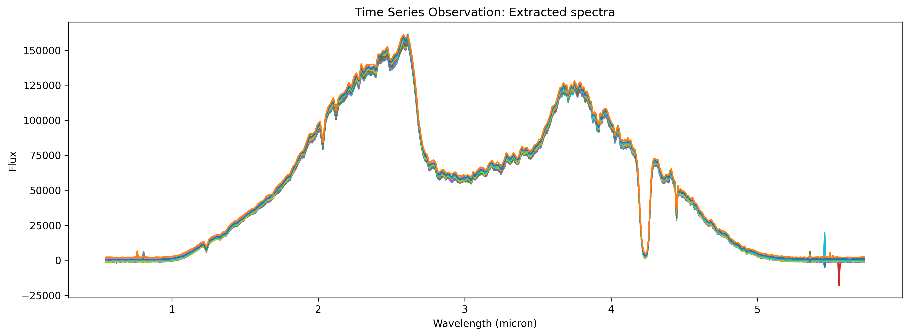

.. _outputs:

Eureka! Outputs
===============

Stage 2 through Stage 6 of ``Eureka!`` can be configured to output plots of the pipeline's interim results as well as the data required to run further stages. 

.. _s2-out:

Stage 2 Outputs
---------------

If ``skip_extract_1d`` is set in the Stage 2 ECF, the 1-dimensional spectrum will not be extracted, and no plots will be made. Otherwise, Stage 2 will extract the 1-dimensional spectrum from the calibrated images, and will plot the spectrum.

   Stage 2 output: 1-Dimensional Spectrum Plot

.. _s3-out:

Stage 3 Outputs
---------------

In Stage 3 through Stage 5, output plots are controlled with the ``isplots_SX`` parameter. The resulting plots are cumulative: setting ``isplots_S3 = 5`` will also create the plots specified in ``isplots_S3 = 3`` and ``isplots_S3 = 1``.

In Stage 3:
   - If ``isplots_S3`` = 1: ``Eureka!`` will plot the 2-dimensional, non-drift-corrected light curve. 

   .. figure:: ../media/S3_out/fig3101.png
      :alt: Stage 3 2-dimensional spectrum plot

      Stage 3 output: 2-Dimensional Spectrum Plot

   - If ``isplots_S3`` = 3: ``Eureka!`` will plot the results of the background and optimal spectral extraction steps for each exposure in the observation, as well as the source position on the detector.

   .. figure:: ../media/S3_out/fig3301.png
      :alt: Stage 3 background subtracted flux plot

      Stage 3 output: Background Subtracted Flux Plot

   .. figure:: ../media/S3_out/fig3302.png
      :alt: Stage 3 1-dimensional spectrum plot

      Stage 3 output: 1-Dimensional Spectrum Plot

   .. figure:: ../media/S3_out/fig3303.png
      :alt: Stage 3 source position fit

      Stage 3 output: Source Position Fit Plot

   .. figure:: ../media/S3_out/fig3305.png
      :alt: Stage 3 weighting profile

      Stage 3 output: Weighting Profile Plot

   - If ``isplots_S3`` = 5: ``Eureka!`` will plot the Subdata plots from the optimal spectral extraction step.

   .. figure:: ../media/S3_out/fig3501.png
      :alt: Stage 3 subdata plot

      Stage 3 output: Spectral Extraction Subdata Plot
   
.. _s4-out:

Stage 4 Outputs
---------------

In Stage 4:
   - If ``isplots_S4`` = 1: ``Eureka!`` will plot the spectral drift per exposure, and the drift-corrected 2-dimensional lightcurve with extracted bins overlaid.

   .. figure:: ../media/S4_out/fig4101.png
      :alt: Stage 4 spectral drift plot

      Stage 4 output: Spectral Drift Plot

   .. figure:: ../media/S4_out/fig4201.png
      :alt: Stage 4 2-dimensional binned spectrum

      Stage 4 output: 2-Dimensional Binned Spectrum

   - If ``isplots_S4`` = 3: ``Eureka!`` will plot the spectroscopic lightcurves for each wavelength bin.

   .. figure:: ../media/S4_out/fig4301.png
      :alt: Stage 4 spectroscopic lightcurve

      Stage 4 output: Spectroscopic Lightcurve

   - If ``isplots_S4`` = 5: ``Eureka!`` will plot the cross-correlated reference spectrum with the current spectrum for each integration, and the cross-correlation strength for each integration.

   .. figure:: ../media/S4_out/fig4401.png
      :alt: Stage 4 cross correlated reference spectrum

      Stage 4 output: Cross-Correlated Reference Spectrum

   .. figure:: ../media/S4_out/fig4501.png
      :alt: Stage 4 cross correlation strength

      Stage 4 output: Cross-Correlation Strength

.. _s5-out:

Stage 5 Outputs
---------------

In Stage 5:
   - If ``isplots_S5`` = 1: ``Eureka!`` will plot the fitted lightcurve model over the data in each channel.
   
   .. figure:: ../media/S5_out/fig5101.png
      :alt: Stage 5 fit data and lightcurve

      Stage 5 output: Fitted lightcurve

   - If ``isplots_S5`` = 3: ``Eureka!`` will plot an RMS deviation plot for each channel to help check for correlated noise, plot the normalized residual distribution, and plot the fitting chains for each channel.

   .. figure:: ../media/S5_out/fig5201.png
      :alt: Stage 5 RMS deviation plot

      Stage 5 output: RMS Deviation Plot
   
   .. figure:: ../media/S5_out/fig5501.png
      :alt: Stage 5 residual distribution

      Stage 5 output: Residual Distribution
   
   .. figure:: ../media/S5_out/fig5402.png
      :alt: Stage 5 fitting chains
   
   .. figure:: ../media/S5_out/fig5403.png
      :alt: Stage 5 fitting chains

      Stage 5 output: Fitting Chains. Only made for ``emcee`` runs. Two version of the plot will be saved, one including the burn in steps and one without the burn in steps. 

   - If ``isplots_S5`` = 5, and if ``emcee`` or ``dynesty`` were used as the fitter: ``Eureka!`` will plot a corner plot for each channel.

   .. figure:: ../media/S5_out/fig5301.png
      :alt: Stage 5 corner plot

      Stage 5 output: Corner Plot

   - If a GP model was used in the fit, then ``Eureka!`` will plot the lightcurve, the GP model, and the residuals.

   .. figure:: ../media/S5_out/fig5121_lc_GP.png
      :alt: Stage 5 GP plot

      Stage 5 output: Lightcurve, GP model, and Residual Plot

.. _s6-out:

Stage 6 Outputs
---------------

In Stage 6:
   - If ``isplots_S6`` = 1: ``Eureka!`` will plot the transmission or emission spectrum, depending
     on the setting of ``y_unit``.

   .. figure:: ../media/S6_out/fig6101_transmission.png
      :alt: Stage 6 transmission spectrum.

      Stage 6 output: Transmission Spectrum.

   .. figure:: ../media/S6_out/fig6101_emission.png
      :alt: Stage 6 emission spectrum.

      Stage 6 output: Emission Spectrum.

   - If ``isplots_S6`` = 3: ``Eureka!`` will make another transmission plot (if ``y_unit`` is
     transmission type) with a second y-axis which is in units of atmospheric scale height.

   .. figure:: ../media/S6_out/fig6301_transmission.png
      :alt: Stage 6 transmission spectrum with a second y-axis in units of atmospheric scale height.

      Stage 6 output: Transmission Spectrum with Double y-axis.
