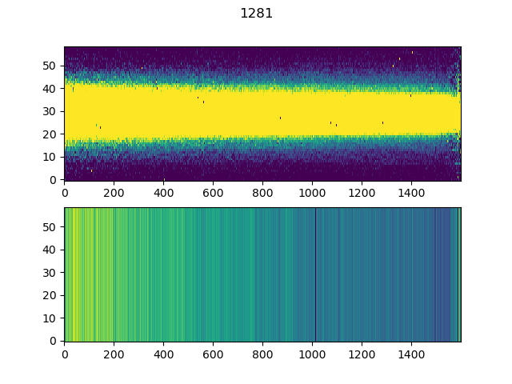

.. _quickstart:

Quickstart
============

1. Clone the ``Eureka!`` repository from `GitHub <http://github.com/kevin218/Eureka>`_ in a directory of your choice.

.. code-block::

	git clone git@https://github.com/kevin218/Eureka

2. Install Eureka! by running ``setup.py``:

.. code-block:: python

	sudo python setup.py install

3. Make a directory on your computer to store the simulated data and ancillary files. E.g.:

.. code-block:: python

	mkdir /User/Data/JWST-Sim/NIRCam/
	cd /User/Data/JWST-Sim/NIRCam/
	mkdir Stage2
	mkdir ancil

4. Download the `simulated NIRCam data <https://stsci.app.box.com/s/8r6kqh9m53jkwkff0scmed6zx42g307e/folder/136379342485>`_ from the STScI Box site and save the files in the Stage2 directory.
You only need the fits files ending with the suffix ``*calints.fits``. The files are large (5 GB total) so the download may take a while.
If your internet connection is slow, download the `smallest file only <https://stsci.app.box.com/s/8r6kqh9m53jkwkff0scmed6zx42g307e/file/809097167084>`_  and the tutorial will still work.

5. Save the `NIRCam calibration data <https://github.com/ers-transit/hackathon-2021-day2/tree/main/ancil_files/NIRCam>`_ in the `ancil` directory.

6. Go into the cloned ``Eureka!`` repository and open the file ``Eureka/demos/S3/S3_template.ecf``.
Update "topdir + datadir" and "topdir + ancildir" to the location of your Stage2 data and the ancil data, respectively.

You can get more information about the ecf (``Eureka!`` control file) :ref:`here<ecf>`.

7. Go into the ``run_eureka.py`` script and update the path with the location of the cloned repository, like you see here:

.. code-block:: python

	sys.path.append('/home/user/Projects/Eureka')

8. Now execute the run_eureka.py script which is in the same directory as the ecf by typing:

.. code-block:: python

	python run_eureka.py

If you use all 21 simulated Stage 2 NIRCam Data segments, this can take around 25 minutes. For a quick look set ``testing`` in ecf to ``True``.
This will only reduce and analyze the last segment (=smallest file) in your Stage 2 Data directory.

9. The code will run and save data and plots in a new directory in ``demos/S3/``.
Below you see an example for a simulated spectrum which you should get after running the script and having ``is_plotsS3 = 3``:

