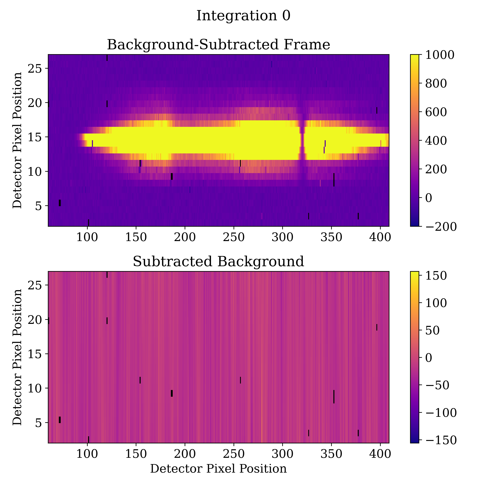
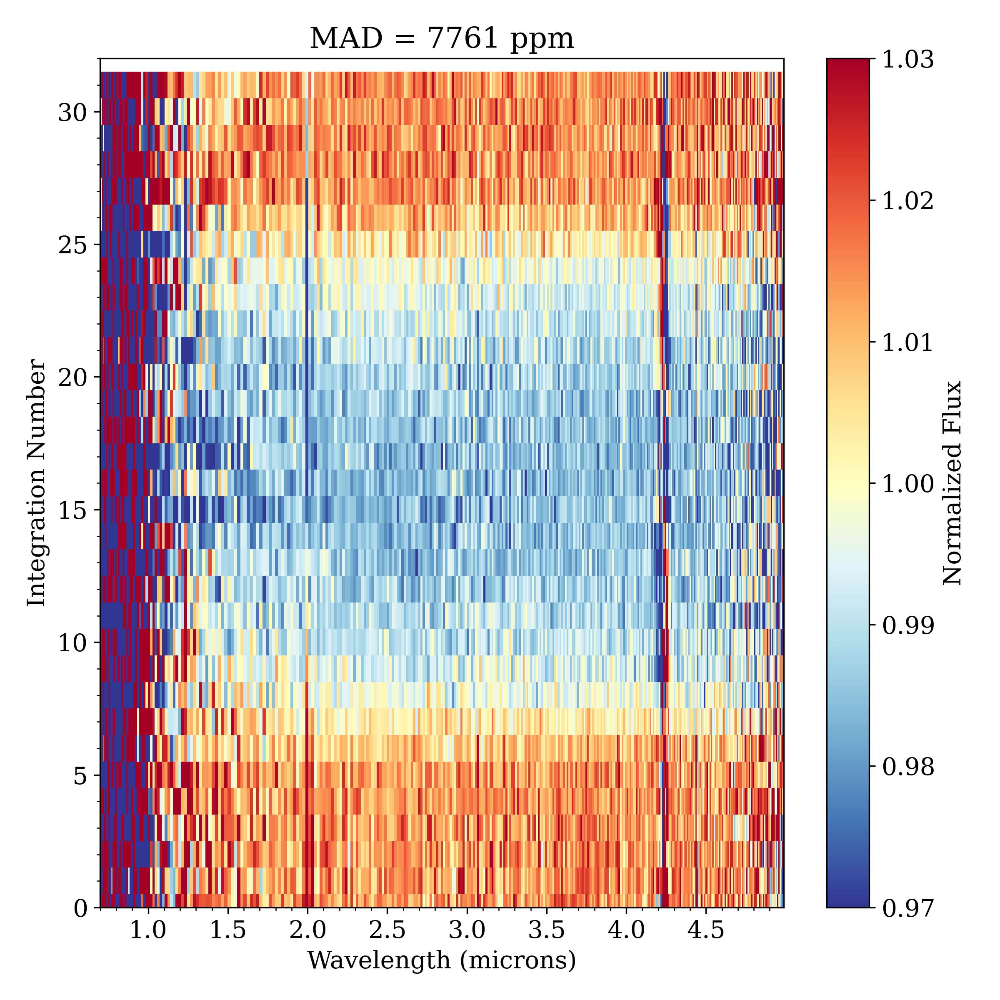
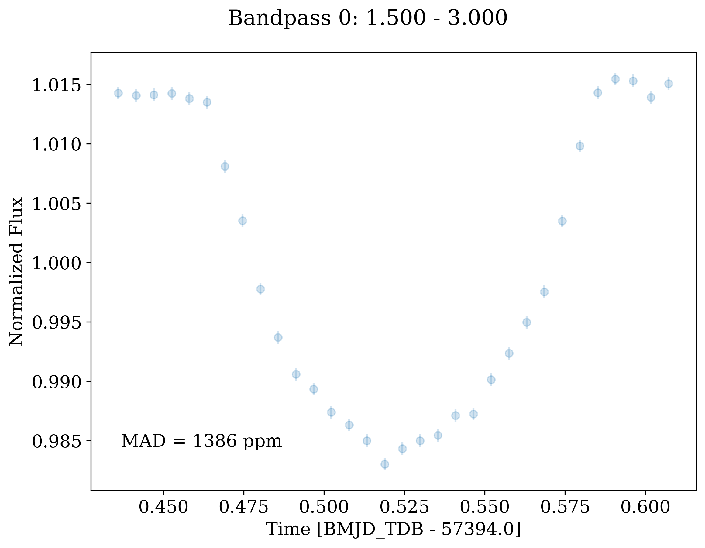
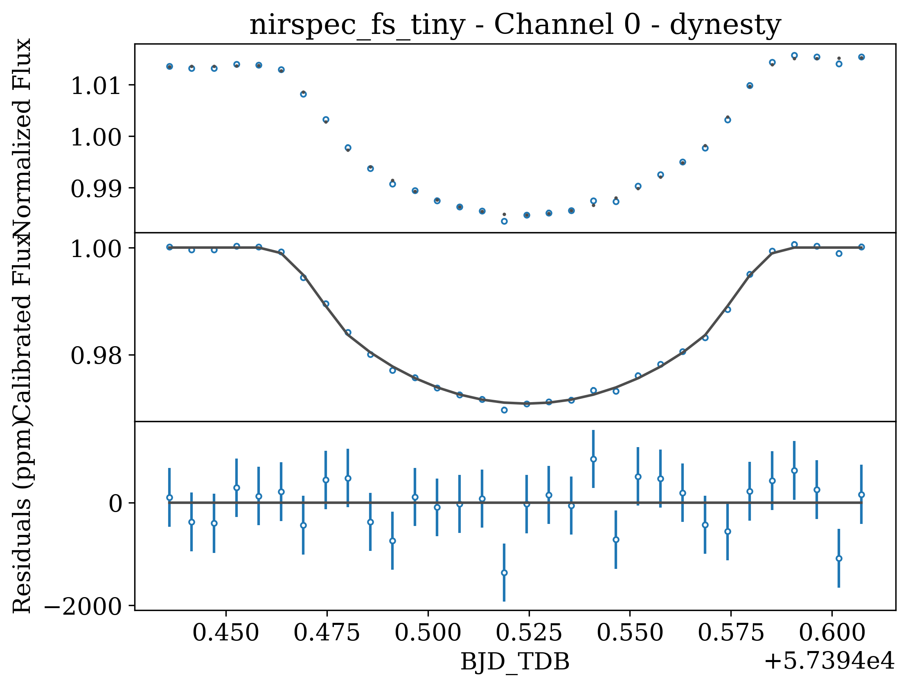
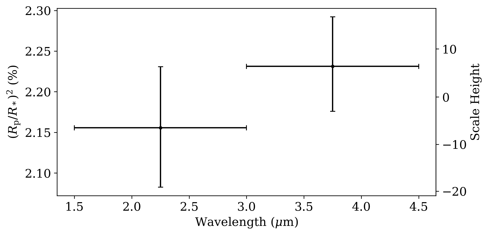

.. _quickstart:

⚡️ Eureka! Quickstart ⚡️
==========================

Want to get up and running with ``Eureka!``, but not really sure where to begin? Keep reading! And if you want a visual overview of ``Eureka!``, be sure to look at our :ref:`stages` documentation page.

1. Installation 📦
------------------

The first thing you need to do is install the package, so if you haven't already, take a break from this page and follow the :ref:`installation` instructions (if you have issues be sure to visit the :ref:`FAQ<faq>` first).

2. Download the data 💾
-----------------------

With the installation complete, you'll need some data to run ``Eureka!`` on. For now let's use some simulated data that was produced for the `Transiting Exoplanet Community ERS <https://ers-transit.github.io/>`_ Data Challenge. Datasets for all four instruments are available on the `STScI Box site <https://stsci.app.box.com/s/tj1jnivn9ekiyhecl5up7mkg8xrd1htl/folder/154382715453>`_, however, for the rest of this quickstart guide the `NIRSpec Tiny dataset <https://stsci.box.com/s/mgicm6yc5c7khljako7yswh619dn5e7a>`_ will be used.

Now, I'm sure you wouldn't just leave the data in your Downloads folder, but if so, let's make a new directory to store things instead. For example:

.. code-block:: bash

	mkdir /User/Data/JWST-Sim/NIRSpec/
	cd /User/Data/JWST-Sim/NIRSpec/
	unzip -j ~/Downloads/Tiny.zip -d .

Note that for Eureka! you do *not* need to download any ancillary data - any additional files will be downloaded automatically (if you correctly set the CRDS environment variables during installation).

3. Set up your run directory 🗂
-------------------------------

In general, it is recommended to interface with Eureka! using "Eureka! Control Files" (ECFs) and running command line scripts.
This helps to increase the automation of the pipeline and increases the reproducibility of your results as the ECF you used
will be copied to the output folder and your analysis will follow a pre-defined order. That way if somebody asks you how you
analyzed your data, you can just send them your copied ECF files and the version number of Eureka! that you used. In the
following section, we will walk you through the process of gathering the relevant ECF templates and editing them as needed for
your particular analysis.

.. _demos:

3.1 Gather the demo files
~~~~~~~~~~~~~~~~~~~~~~~~~

We're almost there, but before you can get things running you need to set up a directory for ``Eureka!`` to store both input and output files.

.. code-block:: bash

	mkdir /User/DataAnalysis/JWST/MyFirstEureka
	cd /User/DataAnalysis/JWST/MyFirstEureka

From here, the simplest way to set up all of the Eureka input files is to download them from the JWST demos directory on the Github repository (`direct download <https://downgit.github.io/#/home?url=https://github.com/kevin218/Eureka/tree/main/demos/JWST>`_). Then we can copy them over:

.. code-block:: bash

	mkdir demos
	unzip -j ~/Downloads/JWST.zip -d ./demos

This demos directory contains a selection of template files to run ``Eureka!``. There are three different types of files:

    -  ``*.ecf``: These are ``Eureka!`` control files and contain input parameters required to run each stage of the pipeline. For more detail on the ecf parameters for each stage, see :ref:`here<ecf>`.
    -  ``*.epf``: This is a ``Eureka!`` parameter file and describes the initial guesses and priors to be used when performing light curve fitting (Stage 5).
    -  ``run_eureka.py``: A script to run the ``Eureka!`` pipeline.

3.2 Customise the demo files
~~~~~~~~~~~~~~~~~~~~~~~~~~~~

You might notice that not all of the demo files will be applicable to every dataset, either because they are tailored to a specific instrument, or because they are for a ``Eureka!`` pipeline stage that precedes the input data. This is the case for the NIRSpec data being used here, which as a ``*rateints.fits`` file (more information on JWST pipeline products `here <https://jwst-pipeline.readthedocs.io/en/latest/jwst/data_products/product_types.html>`_) has already been processed through an equivalent to Stage 1 of ``Eureka!``.

So, let's only copy over the specific files needed to process this NIRSpec dataset further. Given that the dataset contains a transit for WASP-39b, let's also change some of the default filenames to something a little more informative:

.. code-block::

	cp demos/run_eureka.py .
	cp demos/S2_nirspec_fs_template.ecf S2_wasp39b.ecf
	cp demos/S3_nirspec_fs_template.ecf S3_wasp39b.ecf
	cp demos/S4_template.ecf S4_wasp39b.ecf
	cp demos/S5_template.ecf S5_wasp39b.ecf
	cp demos/S5_fit_par_template.epf S5_fit_par_wasp39b.epf
	cp demos/S6_template.ecf S6_wasp39b.ecf

Notice that all of the ``*.ecf`` files have a common ``wasp39b`` string. It's useful to keep this homogenous across files as it is what ``Eureka!`` interprets as an "event label", and is used to locate specific input files when running the pipeline. To see this more clearly, open up the ``run_eureka.py`` file and look at how the individual stages are being called. While you're here, modify the ``eventlabel`` string directly to match the chosen naming:

.. code-block:: bash

        eventlabel = 'wasp39b'

Finally, you need to connect everything together by opening up each ``.ecf`` file and updating the ``topdir``, ``inputdir``, and ``outputdir`` parameters within. **Note** that ``inputdir`` and ``outputdir`` are both relative to ``topdir``. For the ``S2_wasp39b.ecf``, you can do something like:

.. code-block:: bash

	topdir		/home/User/
	inputdir	Data/JWST-Sim/NIRSpec
	outputdir	DataAnalysis/JWST/MyFirstEureka/Stage2

Specifically, you'll want to set ``inputdir`` to the folder where you have put your downloaded FITS files, and ``outputdir`` to the folder where you want the results of your analyses to be stored. This may be useful if you want to store the raw data on an external hard drive while storing the analysis outputs on your internal hard drive. For the later stages you could use something simpler, e.g. for the ``S3_wasp39b.ecf``:

.. code-block:: bash

	topdir		/home/User/DataAnalysis/JWST/MyFirstEureka/
	inputdir	Stage2
	outputdir	Stage3

The explicit settings for the ``S4_wasp39b.ecf``, ``S5_wasp39b.ecf`` and ``S6_wasp39b.ecf`` will be skipped here for brevity (but you should still do them!). However, there are a few important settings we must adjust.

First, you must decide if you want to freely fit for your limb-darkening parameters in Stage 5 or if you want to fix them to model predictions made using the ``exotic-ld`` package. If you want to fit
for limb-darkening, you can simply use the template files as they currently are. However, if you want to use ``exotic-ld``, you must download the ``exotic-ld`` `ancillary files <https://zenodo.org/record/6344946>`_
and change the ``exotic_ld_direc`` in the ``S4_wasp39b.ecf`` file to point to the location you saved those ancillary files. You also need to set ``compute_ld`` to True. In general, you must also
update the stellar parameters for your target, but these have already been set for WASP-39. You will also need to adjust your ``S5_fit_par_template.epf`` limb-darkening parameters to use the
limb-darkening law you want to use (note that not all laws are supported by exotic-ld), and you will also need to change your limb-darkening parameters to be fixed instead of free if you don't
want to fit them. Finally, you will also need to set the ``use_generate_ld`` parameter to ``exotic-ld`` in your ``S5_wasp39b.ecf`` file.

Also, it is important to notice a few settings in the ``S5_wasp39b.ecf``. Specifically, you need to assign the correct ``.epf`` file, and modify the number of processors you want to use during the light curve fitting.

.. code-block:: bash

	ncpu		4
	fit_par		S5_fit_par_wasp39b.epf

To speed up the Stage 5 dynesty fit, you can also reduce the number of live points (``run_nlive``) at the cost of a more coarse corner plot in the end. The bare minimum recommended value is

.. code-block:: bash

	ndim * (ndim + 1) / 2

and our fit presently has ndim=10 free values in the EPF, so that means a bare minimum of 55 live points. As a compromise, let's use 256 live points instead to
get a fairly nice corner plot but also speed up the fit, so set the following in ``S5_wasp39b.ecf``:

.. code-block:: bash

	run_nlive    256

While editing all those files, you may have noticed that there is a whole range of other inputs that can be tweaked and adjusted at each different stage. For now you can ignore these as the demo files have been specifically tailored to this simulated dataset of WASP-39b.

4. Run Eureka! 💡
-----------------

Now that everything is set up, you should now be able to run the pipeline using:

.. code-block:: bash

	python run_eureka.py

This will start printing information to your terminal, saving a bunch of output data/figures to the ``outputdir`` file locations you assigned above, and depending on the number of processors you were brave enough to allocate, potentially make your laptop as noisy as the engine of a Boeing 747.

While running ``Eureka!`` on these simulated data, you should expect to see a few warnings as there are some imperfections in the simulated data which should not be present in real observations.
When you begin to work on your own real observation, you should use your critical judgement to determine whether a warning is relevant to your situation. In general though, it's not uncommon for you to
see a warning about leaked semaphore objects at the end of a run that includes ``ncpu > 1`` in Stage 3 or 5, and these warnings can be safely ignored.

5. Examine Outputs 🤨
-------------------------

Carry on reading for more information on each individual stage in the pipeline and some of the products it produces. Also, feel free to dig through the output directories and get a gauge of what each stage is doing at your own speed.

Stage 1: Ramp Fitting
~~~~~~~~~~~~~~~~~~~~~

Stage 1 takes individual ramp level images and collapses them into integration level images, alongside some other basic corrections. This Stage broadly follows the STScI JWST pipeline methodology, with a few opportunities for adjustment as detailed on the :ref:`.ecf<ecf>` information page.

The NIRSpec data being used here has already undergone the equivalent of this Stage, and it is therefore skipped (you will also notice it is commented out in the ``run_eureka.py`` file).

Stage 2: Calibrations
~~~~~~~~~~~~~~~~~~~~~

Stage 2 calibrates the data by performing a range of steps such as flat fielding and photometric unit conversions. Similarly to Stage 1, this broadly follows the STScI JWST pipeline methodology. In the case of the NIRSpec dataset we are using, the ``Eureka!`` implementation of this Stage avoids any spatial trimming of the images that usually occurs with the STScI pipeline. This facilitates a more accurate correction of the background and 1/f noise during Stage 3, as more background pixels are retained.

Stage 3: Reduction
~~~~~~~~~~~~~~~~~~

From Stage 3 onwards, ``Eureka!`` no longer makes use of the STScI pipeline and instead implements a range of custom routines to reduce the data further. It's at this stage that background subtraction and spectral extraction is performed, resulting in 1D spectra that can be used for light curve analysis and fitting.

By entering the ``figs`` folder you'll find a range of diagnostic figures. For example, on the left hand side of the figure copied below, the background subtracted 2D spectrum for the first integration is plotted (top) alongside a 2D image of the estimated background. Note that the distinct striping is a result of 1/f noise in the NIRSpec detector electronics, and is dominant along pixel columns as they correspond to the direction of the detector readout.

To the right you can see a 2D representation of the variation in flux between consecutive integrations as a function of wavelength. In fact, the transit of WASP-39b can be seen via the horizontal band of reduced flux between integrations ~9-25. At the top, the median absolute deviation (MAD) for the entire dataset is displayed, and is calculated by determining the flux difference between each image and the next, for each wavelength, followed by taking the overall median of these values across all wavelengths and all images.

Finally, note that the actual data for these produced 1D spectra are contained in the ``*Table_Save.txt`` file.

Stage 4: Create Lightcurves
~~~~~~~~~~~~~~~~~~~~~~~~~~~

Stage 4 takes the 1D spectra produced by the previous stage and turns them in to light curves. The number of wavelength channels to turn into light curves, along with the wavelength range across which they will be calculated, can be defined in the Stage 4 ``.ecf`` file. In the interest of reducing the computational burden of the following light curve fitting stage, only two light curves will be generated corresponding to 1.5-3.0 μm and 3.0-4.5 μm (see figure below).

Similarly to Stage 3, the actual data for the produced light curves can be found in the ``*Table_Save.txt`` file.

Stage 5: Lightcurve Fitting
~~~~~~~~~~~~~~~~~~~~~~~~~~~

Stage 5 takes all of the lightcurves produced by the previous stage and performs a variety of fitting routines to estimate specific system and planetary properties. For this quickstart, the fitting was performed using nested sampling as implemented by ``dynesty``, for a model assuming a transit of WASP-39b plus an aribitrary linear polynomial trend.

As a reminder, the input initial guesses and priors for the model properties are contained within the Stage 5 ``.epf`` file. To facilitate this quickstart demo, input parameters applicable to WASP-39b have already been assigned. For your own reductions, you'll need to tailor this file to the system you are observing and the type of fit you want to perform.

We have used nested sampling during this quickstart, however, this is not the only fitting method - both a simple least-squares minimisation as implemented by ``scipy`` and a full MCMC as implemented by ``emcee`` can also be used. Given the computational demands of running nested sampling or MCMC, it's advised that you perform initial testing with the least-squares fitter, before moving to a more advanced fitter. As the quickstart Stage 5 ``.ecf`` and ``.epf`` have already been prepared with suitable input values, we have skipped straight to a nested-sampling fit.

An example figure demonstrating the best fit model lightcurve alongside the data is shown below, and corner plot representations of the fit posteriors can be found under the ``figs`` directory. Once again, the actual model light curve data can be found in the ``*Table_Save_ch*.txt`` files.

Stage 6: Plot Spectra
~~~~~~~~~~~~~~~~~~~~~

The final Stage of ``Eureka!``, Stage 6, takes the output data from the lightcurve fitting and produces transmission and/or emission spectra. As mentioned earlier, this quickstart only makes use of two different light curves from this dataset from 1.5-3.0 μm and 3.0-4.5 μm. In this case, our transmission spectrum for the transit of WASP-39b will only have two data points (see figure below). Note that the errors bars are not representative of what could be expected for true JWST data, as to reduce the computational burden this dataset has been trimmed down from 8192 integrations to only 32. Finally, the transmission spectrum data is saved in the ``*Table_Save.txt`` file.

6. Where to go next 👩‍💻
-------------------------

You made it! Congratulations, it's time to reward yourself with a break 😊

If you got a bit lost along the way, you should check out our visual overview of the stages of ``Eureka!`` on our :ref:`stages` documentation page.

If this quickstart guide wasn't enough to sate your appetite, consider taking a look at all the different parameter settings within the ``*.ecf`` files on our :ref:`ecf` documentation page and tweak away! If you want to explore the NIRSpec Tiny Dataset further, head back to the Stage 4 ``.ecf`` and try increasing the number of wavelength channels. Once you're comfortable, consider running things through with the `full dataset <https://app.box.com/folder/154382679630?s=f6ehe1i2tsn9dih8zl0emyvjm9vemh1r>`_. Or, if you're bored with NIRSpec, maybe take a look at a simulated dataset for `NIRCam <https://app.box.com/folder/154382958627?s=ctuol6orkulkrytbt7ajbd5653j93tg4>`_, `NIRISS <https://app.box.com/folder/154382588636?s=tyg3qqd85601gkbw5koowrx0obekeg0m>`_, or `MIRI <https://app.box.com/folder/154382561036?s=h662fiy3baw29ftulc9jxggoesq1u06y>`_ instead.

If any bugs / errors cropped up while you were working through this quickstart, or if they turn up in the future, take a look at our :ref:`FAQ<faq>` or `report an issue <https://github.com/kevin218/Eureka/issues/new/choose>`_ on our GitHub repository. Thanks!

7. HST Operations 🛰️
--------------------

Using ``Eureka!`` for HST operations works much the same way as JWST. Instead of
using simulated data, we can use the ``download_data_HST_template.py`` script
in your ``Eureka!`` installation's `demos <demo_link_>`_ folder to grab just
the first visit of a transit of the planet HD 209458 b. Line 9 specifies this:

.. code-block:: python

	# List of one or more visit numbers
	visits = [60]

where ``[60]`` can be replaced with a list of the visit numbers you want to
download, e.g. ``[60, 61, 62, 63, 64]`` if you want the entire transit
observation.

You'll also need to change the ``final_dir`` variable to a more appropriate
location for your data, similar to how we made a new directory for the JWST
data above.

The relevant HST-specific ECFs are also in your ``Eureka!`` installation's
`demos <demo_link_>`_ folder, and the HST-specific parameters are also described
in the :ref:`ECF reference <ecf>` page.

Note that HST operations start at Stage 3, unlike JWST operations. HST systematics
can also be slightly more complicated to fit, so it may be worthwhile to read some
papers discussing these, such as `Knutson et al. (2014) <knutson2014_>`_ or
`Brande et al. (2022) <brande2022_>`_. Exponential ramps are available as systematics
models in ``Eureka!`` Stage 5, and Eureka automatically corrects for the 
spatial scan flux offset.

.. _demo_link: https://github.com/kevin218/Eureka/tree/main/demos
.. _knutson2014: https://ui.adsabs.harvard.edu/abs/2014ApJ...794..155K/abstract
.. _brande2022: https://ui.adsabs.harvard.edu/abs/2022AJ....164..197B/abstract
